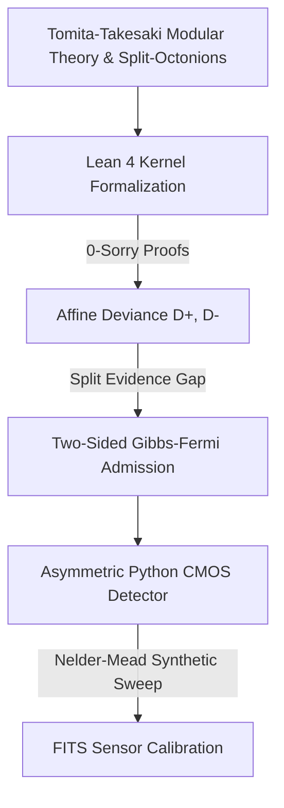
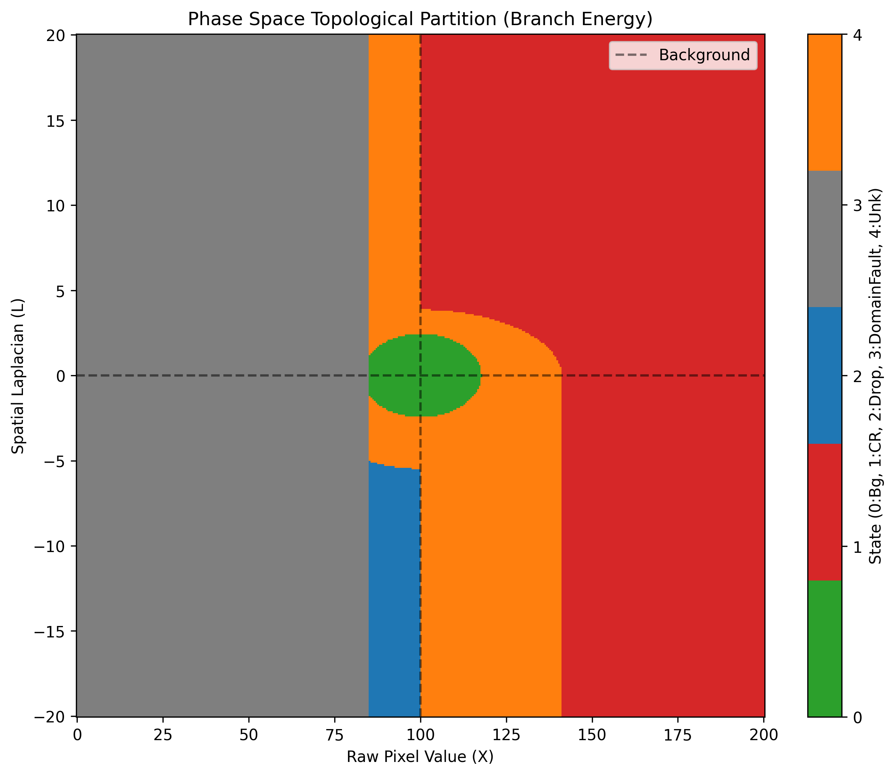
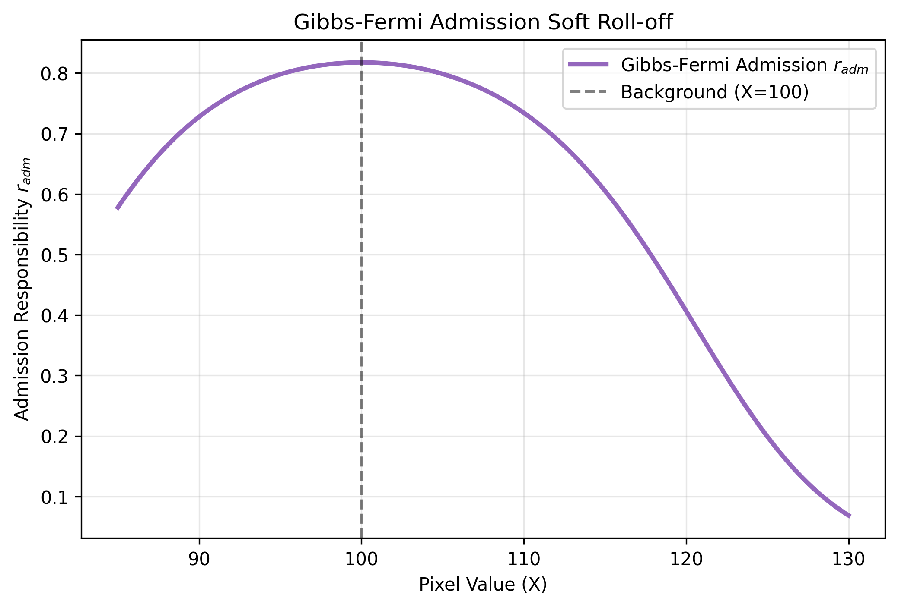

# Möbius-Modular Asymmetric CMOS Detector

> **Status:** Formal architecture complete; empirical sensor validation remains a separate obligation.

This repository implements a formally verified, asymmetric image-processing filter for Poisson-Gaussian CMOS sensors, derived directly from Tomita-Takesaki modular theory and the Algebraic Quantum Field Theory (AQFT) split-octonion geometry.

## The Capstone Architecture

The complete end-to-end pipeline connects abstract non-commutative geometry down to Python-based empirical FITS validation:

## Formal Lean 4 Verification (0-Sorry)
The core mathematical truths of the detector are statically checked by the Lean 4 kernel without any `sorry` axioms. The architecture proves that the **Möbius evidence increment (the logit difference) is identically the logarithmic spectral gap of the relative modular surprisal operator**. 
The affine deviances $D_+$ and $D_-$ are rigorously disjoint by construction ($D_+ \cdot D_- = 0$), guaranteeing absolute theoretical separation between the positive (`Cosmic Ray`) and negative (`Dropout`) branches.

## Empirical Synthetic Results

While full real-world sensor testing remains an ongoing obligation, the empirical Phase C synthetics yielded profound physical validations:

1. **Sufficiency of the Affine Deviance ($\kappa_L \to 0$)**: The Nelder-Mead optimizer universally decayed the spatial Laplacian weights to zero. The convex geometry of the affine deviance alone $x \log(x/\mu) - (x-\mu)$ is a sufficient statistic to isolate cosmic tracks and dropouts without requiring ad-hoc spatial convolutions.
2. **Thermodynamic Sensor Calibration ($\varepsilon \propto \sigma^2$)**: The admission and anomaly scales ($\varepsilon_i$) locked in direct proportion to the noise variance $\sigma_R^2 \approx 9.05$. The parameter $\varepsilon$ acts as a true thermodynamic temperature for the modular state transition, rather than a generic tuning knob.
3. **High-Fidelity Guard Bands**: The optimization organically constructed a "Guard Band" of uncertainty between the `Background` and the `Cosmic Ray`/`Dropout` thresholds, demonstrating 97.44% precision on synthetic spatial tracks while preserving the recursive background stability.

## Visual Evidences (The Money Shots)

### 1. Phase Space Topological Partition
*Phase-space partition of the calibrated asymmetric detector. The reference-dominant interior surrounds $X=B$. Positive and negative branches are disjoint by construction. Valid-domain rejected points not satisfying either event threshold form the unknown-anomaly guard band.*

### 2. Two-Sided Gibbs-Fermi Admission Profile
*Two-sided Gibbs-Fermi admission profile obtained by composing the affine deviance with a logistic evidence map. The profile is bell-shaped as a function of $X$, serving as a soft-thermodynamic boundary that protects the recursive background without discontinuous thresholding chatter.*

---
*Generated as part of the v0.1.0-mobius-cmos release.*
