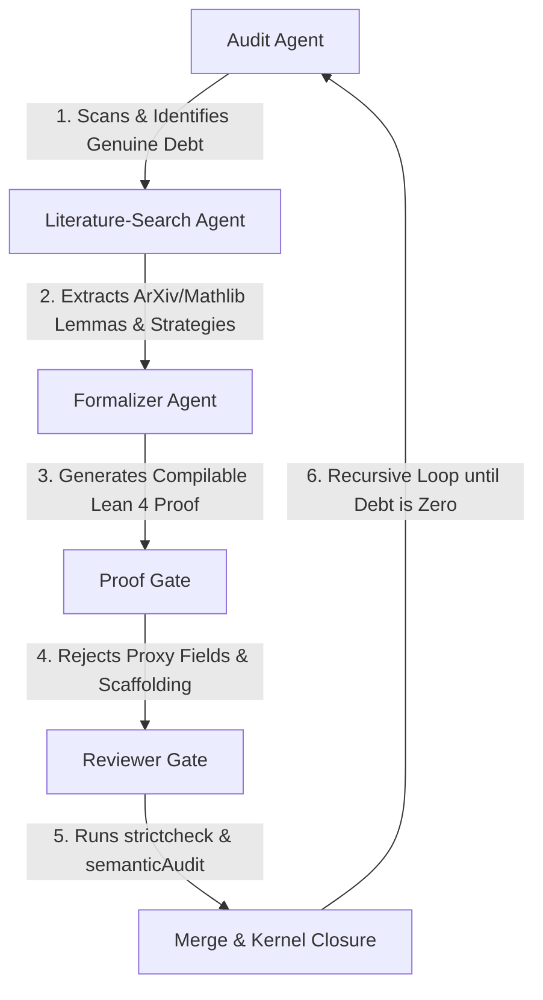

# Staged Multi-Agent Alchemical Proof Closure Pipeline Specification

This document defines the formal roles, strict gate rules, and recursive execution protocols for the multi-agent pipeline designed to eliminate vacuous coordinate scaffolding and pay the mathematical closure debt in `InfoGeometry`.

## 1. Pipeline Architecture

---

## 2. Agent Role Specifications

### Agent 1: The Audit Agent
* **Core Mandate**: Scan all target files and classify declarations. Distinguish between genuine mathematical debt and placeholder/vacuous/proxy surfaces.
* **Output Format**: A structured, zero-prose debt index mapping the exact files and lines containing unresolved `sorryAx`, uninstantiated structures, or hollow `Prop` sockets.
* **Prohibitions**: Forbidden from attempting mathematical proving or literature search.

### Agent 2: The Literature-Search Agent
* **Core Mandate**: Query external sources (Mathlib, Lean Zulip archives, GitHub repositories, arXiv, academic math databases) to locate mathematical formulations, equivalence claims, and proof strategies matching the active target debt.
* **Output Format**: Structural literature digests containing the exact theorem statement in standard mathematical notation, list of citations/ArXiv IDs, and a step-by-step mathematical proof plan.
* **Prohibitions**: Forbidden from writing Lean 4 code or making file edits.

### Agent 3: The Formalizer Agent
* **Core Mandate**: Take the structural literature digest and formalize a single theorem at a time in Lean 4.
* **Output Format**: Compilable, syntactically correct Lean 4 declarations (`def`, `theorem`, `lemma`) and complete proof blocks.
* **Prohibitions**: Strictly forbidden from introducing `sorry`, `admit`, or synthetic witness-field expansions (Class D vacuous code).

---

## 3. Strict Gate Rules

### Gate 1: The Proof Gate (Mandate IX / Pauli Mandate Compliance)
* **Objective**: Protect the codebase from synthetic/proxy refactoring and wrapper injection.
* **Rejection Criteria**:
  * **Rule 1.1**: REJECT any edit that replaces an unproved `Prop` socket with more detailed but still unproved structure fields (Class D witness-field packaging).
  * **Rule 1.2**: REJECT any edit that introduces new classes, helper abstractions, or custom macros unless they are strictly required by the compiler to resolve the immediate proof.
  * **Rule 1.3**: REJECT any edit containing `sorryAx`, `admitAx`, or equivalent placeholders in active verification targets.
* **Action**: Auto-revert any violating commit and return the target to the Formalizer Agent.

### Gate 2: The Reviewer Gate (Linter & Semantic Auditor Compliance)
* **Objective**: Verify kernel correctness and lack of regressions.
* **Validation Steps**:
  * **Step 2.1**: Run `lake build` to ensure the entire target compiles successfully.
  * **Step 2.2**: Run `lake script run changedVerify` to confirm sequential file gates pass.
  * **Step 2.3**: Run `lake script run semanticAudit` to verify no new banned constructs or non-approved axioms have been introduced.
  * **Step 2.4**: Run `tools/quality/mathfulness_audit.py` to confirm that the promoted target changes status from `blocked` or `vacuous` to `kernel_theorem`.

---

## 4. Recursive Protocol

The pipeline runs recursively:
$$\text{Remaining Debt} = \text{Total Gaps} - \text{Kernel-Checked Theorems}$$
The loop continues until:
1. $\text{Remaining Debt} = 0$, or
2. No remaining solvable mathematical targets exist in the active queue.
