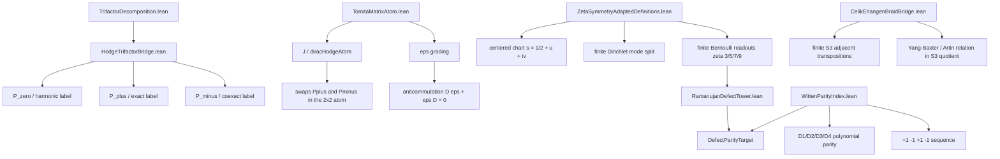

# Architectural Dependency Map: Finite Hodge/Trifactor/Witten Corridor

> Status: `live architecture map`
> Audited: 2026-06-10
> Boundary: finite algebraic corridor only. The diagram contains interpretation
> labels, but the Lean theorems are the module-local finite statements named
> below.

## Verified Corridor

## Module Responsibilities

### `HodgeTrifactorBridge.lean`

Defines the finite dictionary:

- `HodgeSector.exact ↔ TrifactorSector.plus`;
- `HodgeSector.coexact ↔ TrifactorSector.minus`;
- `HodgeSector.harmonic ↔ TrifactorSector.zero`.

Key theorem surface:

- `hodgeTrifactorEquiv`;
- `hodge_trifactor_decomposition`;
- `T_annihilates_harmonicSector`;
- `T_on_exactSector`;
- `T_on_coexactSector`;
- linear-map preservation lemmas for the three sector components.

### `TomitaMatrixAtom.lean`

Owns the finite `2×2` atom:

- `J`;
- `eps`;
- `Pplus`;
- `Pminus`;
- `ellPlus`;
- `ellMinus`;
- `diracHodgeAtom`.

Key theorem surface:

- `diracHodgeAtom_eq_J`;
- `diracHodgeAtom_sq`;
- `diracHodgeAtom_anticommutes_eps`;
- `diracHodgeAtom_conj_Pplus`;
- `diracHodgeAtom_conj_Pminus`;
- `diracHodgeAtom_mul_Pplus`;
- `diracHodgeAtom_mul_Pminus`.

### `ZetaSymmetryAdaptedDefinitions.lean`

Owns the centered arithmetic readout:

- centered coordinates `s = 1/2 + u + iv`;
- critical mirror fixed locus;
- finite Dirichlet and Euler readouts;
- completed-xi evenness consequences from explicit reflection hypotheses;
- finite Bernoulli readouts for `ζ(3)`, `ζ(5)`, `ζ(7)`, and `ζ(9)`.

### `RamanujanDefectTower.lean`

Owns the finite `DefectParityTarget` interface and the proved parity targets for
the first four odd-zeta Bernoulli readouts.

### `WittenParityIndex.lean`

Owns the symbolic parity API:

- `D1_even_parity`;
- `D2_odd_parity`;
- `D3_even_parity`;
- `D4_odd_parity`;
- `witten_parity_index_evaluation`;
- `ramanujan_defect_layers_follow_witten_sequence`.

### `CelikErlangenBraidBridge.lean`

Owns a finite three-sheet permutation model:

- `FiberState`;
- `sigma1`;
- `sigma2`;
- `sigma1_squared`;
- `sigma2_squared`;
- `yang_baxter_braid_relation`;
- signed readout identities for `spectral_parameter`.

It is the symmetric-group quotient model of the adjacent transposition relation,
not a theorem of full braid-group holonomy.

## Explicit Non-Claims

This map does not assert:

- the Riemann Hypothesis;
- zeta-zero confinement;
- analytic Hodge decomposition;
- infinite Tomita-Takesaki theory;
- KMS/CFT/AdS equivalence;
- full braid-group holonomy or Berry curvature;
- UHF C*-completion or Cantor spectral theorem.

Those remain separate theorem debt until their exact analytic or geometric
premises are formalized.

