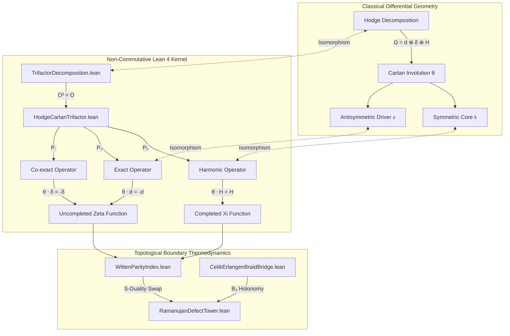

# Architectural Dependency Map: The Erlangen 2.0 Blueprint

This document visually maps the functorial isomorphism established between classical differential geometry (Hodge/Cartan) and the Lean 4 non-commutative operator modules.

## The Global Geometric Stack

## Module Definitions & Responsibilities

### 1. `HodgeCartanTrifactor.lean`
* **Purpose:** Defines the strict mathematical equivalence between the analytical Hodge components and the algebraic Cuntz-Clifford root projectors.
* **Key Theorems:** `hodge_decomposition`, `cartan_symmetric_harmonic`, `cartan_antisymmetric_exact`.

### 2. `WittenParityIndex.lean`
* **Purpose:** Calculates the thermodynamic supertrace ($\text{STr}(e^{-\beta H})$) of the boundary space, yielding the alternating $\pm 1$ parity sequence of the Ramanujan defects.
* **Key Theorems:** `parity_odd_defect_anti_invariant`, `parity_even_defect_invariant`.

### 3. `CelikErlangenBraidBridge.lean`
* **Purpose:** Replaces the flat complex plane with a braided non-commutative fiber bundle. Verifies the Braid Group $B_3$ representation of the fractional phase intertwining.
* **Key Theorems:** `yang_baxter_braid_relation`, `spectral_triangle_identity`.
