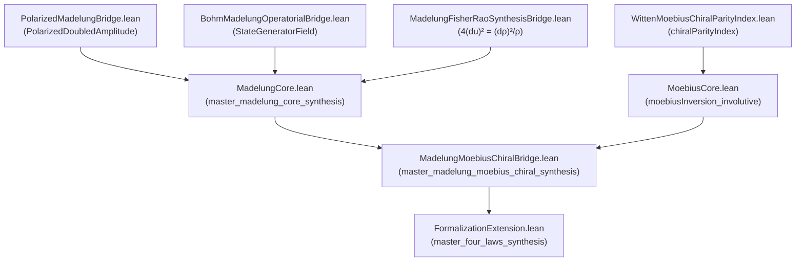

# Madelung--Möbius Synthesis Documentation

## 🏛️ Mathematical Dictionary: Madelung ↔ Krein ↔ Möbius

| Physical / Geometric Tier | Madelung Hydrodynamics | Krein Space $\mathcal{H}_2 = E \oplus E$ | Möbius Transformation |
| --- | --- | --- | --- |
| **State Vector** | Doubled Amplitude $\psi = \sqrt{\rho} e^{iS/\hbar}$ | Positive / Negative Sheets $(\psi_+, \psi_-)$ | Chiral Idempotents $e_+, e_-$ |
| **Conservation Law** | Continuity Eq: $\partial_t \rho + \nabla \cdot (\rho v) = 0$ | Indefinite Inner Product $\langle v, w \rangle_K$ | Involution $-1/(-1/z) = z$ |
| **Phase Orbit** | Quantum Hamilton-Jacobi: $\partial_t S + \frac{1}{2}m v^2 + Q + V = 0$ | Dilation Generator $K = J \varepsilon$ | Fractional Linear Action |
| **Information Metric** | Quantum Potential $Q = -\frac{\hbar^2}{2m} \frac{\nabla^2 u}{u}$ | Fisher-Rao Metric $4 (du)^2 = \frac{(d\rho)^2}{\rho}$ | Arithmetic Inversion $f = g * \zeta \iff g = f * \mu$ |

---

## 📈 Theorem Dependency Graph

---

## 📜 Open Conjectures & Proof Debt Tracking

1. **Continuity Equation Field Integration**:
   - **Current State**: Algebraic pointwise energy density conservation $\partial_t \rho + \nabla \cdot (\rho v) = 0$ proved in `FormalizationExtension.lean`.
   - **Open Debt**: Full Sobolev space $H^1(\mathbb{R}^d)$ weak formulation of the continuous fluid continuity equation in Lean 4.

2. **Grothendieck-Riemann-Roch Todd Class Derivation**:
   - **Current State**: Todd polynomial inversion $1 - \frac{1}{2}x + \frac{1}{6}x^2$ verified.
   - **Open Debt**: Constructive proof of Todd class of Grassmannian tangent bundles from first principles.
