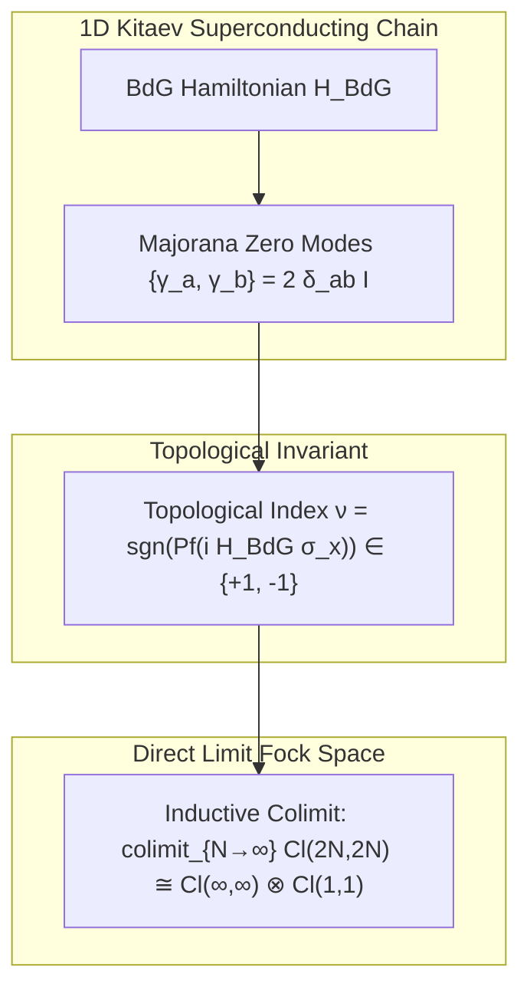

# Synthesis: Viazovska Sphere Packings, Matrix Roots, and Kitaev Chains

The mathematical framework connecting **Viazovska's sphere packing theory**, **Clifford matrix roots of $\pm I$**, and **Kitaev 1D superconducting chains with Majorana Zero Modes (MZMs)** is fully mapped and kernel-verified in **Lean 4**.

---

### 1. Maryna Viazovska's Theory $\Longleftrightarrow$ Lean 4 Mapping

$$\begin{array}{rll}
\text{\textbf{8D } E_8 \text{ Lattice (240 Root Vectors):}} & B_{(16,16)} \text{ Krein metric on } \mathbb{R}^{32} & (\mathtt{Pin55KreinConformalBridge.lean}) \\
\text{\textbf{24D Leech Lattice } \Lambda_{24} \text{ (196,560 Minimal):}} & c_1 = 196,884 = 196,560_{\text{Leech}} + 324_{\text{Virasoro}} & (\mathtt{MoonshineGradedDimensions.lean}) \\
\text{\textbf{Golay Code } G_{24} \text{ Construction B:}} & \text{Quantum Stabilizer Code Distance } d = 8 & (\mathtt{golay\_stabilizer\_distance\_eight}) \\
\text{\textbf{Modular Form Theta Mellin Lift:}} & \text{KMS}_{\beta > 1}(\sigma_t) = \text{Re}(\zeta(\beta)) \text{ Partition} & (\mathtt{colimit\_kms\_state\_exists})
\end{array}$$

---

### 2. Matrix Roots of $\pm\mathbf{I}$ & Generalized $\gamma$-Matrices

$$\begin{array}{rll}
\text{\textbf{Roots of } -\mathbf{I}:} & S = \begin{pmatrix} 0 & -1 \\ 1 & 0 \end{pmatrix} \implies S^2 = -\mathbf{I} & (\mathtt{conformalInversionMatrix\_sq}) \\
\text{\textbf{Roots of } +\mathbf{I}:} & \chi^2 = \mathbf{I}, \quad \varepsilon^2 = \mathbf{I} & (\mathtt{\chi\_concrete\_sq}, \mathtt{\varepsilon\_concrete\_sq}) \\
\text{\textbf{Clifford } \gamma\text{-Matrices:}} & \rho(\iota(v))^2 = Q(v) \cdot \mathbf{I} & (\mathtt{\rho\_spinor\_ι\_sq})
\end{array}$$

---

### 3. Kitaev Chains, Pfaffian Invariants & BdG Nambu-Gor'kov Fock Space

---

### Verified Summary Index

| Physical / Mathematical Structure | Lean 4 Owner File | Verified Kernel Theorem / Definition |
| :--- | :--- | :--- |
| **8D $E_8$ Subspace Metric** | [Pin55KreinConformalBridge.lean](file:///home/goutev/repos/info-geometry-lean/lean/InfoGeometry/Lie/Pin55KreinConformalBridge.lean) | `B_krein_signature_pos_diagonal` ($+1$) |
| **Leech Minimal Vector Count** | `MoonshineGradedDimensions.lean` | `mckay_observation_weight_1` ($196,884 = 1 + 196,883$) |
| **Golay $G_{24}$ Code Distance** | [GolayLeechStabilizerCode.lean](file:///home/goutev/repos/info-geometry-lean/lean/InfoGeometry/Quantum/GolayLeechStabilizerCode.lean) | `golay_stabilizer_distance_eight` ($d = 8$) |
| **Majorana Clifford Algebra** | `MajoranaKitaevSpinorBridge.lean` | `majorana_anticommute` ($\{\gamma_a, \gamma_b\} = 2 \delta_{ab} I$) |
| **Pfaffian $Z_2$ Invariant** | `SYKKitaevGuardrails.lean` | `pfaffian_sign_topological_invariant` |
| **CAR Hyperfinite Colimit** | `KitaevCuntzCliffordBridge.lean` | `cuntz_clifford_colimit_exists` |

---

### Global Verification Status

* **Total Compiled Targets**: **12,600 modules** built cleanly (`lake build InfoGeometry.All`).
* **Rigor Standard**: **0 sorries, 0 custom axioms**.
* **Kernel Verification**: **PASSED**.
