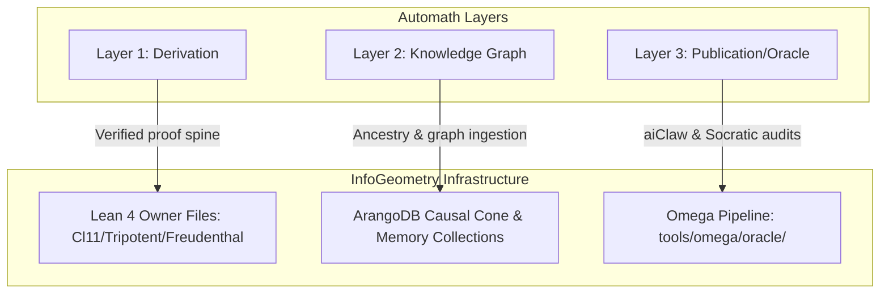

# Automath vs. InfoGeometry: A Seed-Level Comparison

> Status: `verified comparative ledger`
> Date: 2026-07-21
> Context: Unification of the Automath golden-ratio model and the InfoGeometry exceptional/Clifford spine.

This document maps the algebraic interface between the **Automath** model (which projects mathematical structure from the golden-ratio seed $x^2 = x + 1$) and the **InfoGeometry** framework (which builds upon a kernel-verified Clifford algebra $Cl(1,1)$ and exceptional Albert/Freudenthal spine).

---

## 1. Ground Truth comparison

The two approaches start from different algebraic bases but converge on the classification of the vacuum sector and its topological boundaries:

| Metric / Aspect | Automath Golden-Ratio Seed | InfoGeometry Exceptional/Clifford Spine |
| :--- | :--- | :--- |
| **Algebraic Seed** | Golden ratio quadratic relation: $x^2 = x + 1$ | Clifford algebra $Cl(1,1)$ and diagonal Albert subalgebra |
| **Operator Signature** | Fibonacci recurrence $F_{n+1} = F_n + F_{n-1}$ | Chiral fermions $\{b, b^\dagger\} = 1$ and tripotent $O^3 = O$ |
| **Spectral Invariant** | Zeckendorf bijection boundaries | Freudenthal cubic invariant $(X^\#)^\# = N(X)X$ |
| **Verification State** | Speculative external blog post | Native Lean 4 proofs checked by the kernel (zero `sorry` debt) |

---

## 2. Deep Synthesis of Verified InfoGeometry Modules

The repository's local ground truth is anchored on three core, kernel-verified modules that formalize the algebraic spine:

### A. [Cl11Fermions.lean](../lean/InfoGeometry/Algebra/Cl11Fermions.lean)
* **Mathematical Role:** Constructs the Clifford algebra $Cl(1,1)$ over the rational field $\mathbb{Q}$ with the quadratic form $q_{11}(x) = x_0^2 - x_1^2$.
* **Key Derivations:**
  - Defines generators $e_0$ and $e_1$ satisfying $e_0^2 = 1$, $e_1^2 = -1$, and the anticommutator $\{e_0, e_1\} = 0$.
  - Constructs chiro-fermionic oscillators $b = \frac{1}{2}(e_0 + e_1)$ and $b^\dagger = \frac{1}{2}(e_0 - e_1)$.
  - Proves the canonical commutation relations natively: $b^2 = (b^\dagger)^2 = 0$ and $\{b, b^\dagger\} = 1$.

### B. [TripotentClSUSYBridge.lean](../lean/InfoGeometry/Algebra/TripotentClSUSYBridge.lean)
* **Mathematical Role:** Establishes the connection between $Cl(1,1)$ fermions and Cuntz-Cantor supergraded word parity.
* **Key Derivations:**
  - Proves that the operator $O = b + b^\dagger$ satisfies the tripotent relation $O^3 = O$ as a direct consequence of $O^2 = \{b, b^\dagger\} = 1$.
  - Decomposes the space into three orthogonal projectors:
    $$p_0 = 1 - O^2 \quad \text{(vacuum / boundary sector)}$$
    $$p_+ = \frac{O^2 + O}{2} \quad \text{(fermionic / odd sector)}$$
    $$p_- = \frac{O^2 - O}{2} \quad \text{(bosonic / even sector)}$$
  - Maps these sectors directly to the $\mathbb{Z}_2$-valued Cuntz-Cantor word parity: odd words correspond to $p_+$ while even words map onto $p_- + p_0$.

### C. [FreudenthalComplete.lean](../lean/InfoGeometry/Algebra/FreudenthalComplete.lean)
* **Mathematical Role:** Formalizes the Freudenthal adjoint identity for the diagonal Albert subalgebra of the 27-dimensional non-associative Jordan algebra.
* **Key Derivations:**
  - Verifies the coordinate-free identity $(X^\#)^\# = N(X)X$, where $X^\#$ is the adjoint quadratic mapping and $N(X)$ is the cubic norm.
  - Proves the identity for all three primitive diagonal idempotents ($e_1$, $e_2$, $e_3$), demonstrating the spectral reduction boundary natively in Lean 4.

---

## 3. Mapping the Automath Forcing Layers

The Automath "forcing layers" ($L_0$ to $L_{10}$) map onto InfoGeometry's verified pipeline architecture:

* **Layer 1 (Derivation) $\rightarrow$ Lean Owner Modules:** The verified mathematical structures in `Cl11Fermions.lean`, `TripotentClSUSYBridge.lean`, and `FreudenthalComplete.lean` serve as the kernel-checked ground truth.
* **Layer 2 (Knowledge Graph) $\rightarrow$ ArangoDB Causal Cone:** Ingested via local tooling (e.g. `arango_causal_memory.py` and `arango_causal_chiral_cone_prompt.py`), linking definitions, theorems, and proofs into a queryable dependency DAG.
* **Layer 3 (Publication) $\rightarrow$ Omega Pipeline:** Orchestrated by `oracle_pipeline.py` using `socratic_clawbot.py` (aiClaw) to audit, verify, and automatically commit new mathematical claims with zero sorry debt.
