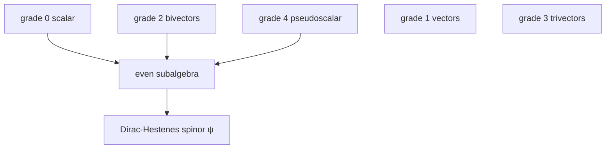

# Hestenes and the Dirac Equation in Geometric Algebra

## Executive summary

This report assumes an advanced undergraduate or graduate reader, because the target level was not specified. In that register, the shortest accurate characterisation is this: Hestenes’s reformulation is not a different empirical theory from the Dirac equation of entity["people","Paul Dirac","theoretical physicist"], but a mathematically equivalent rewriting of one-particle Dirac theory into the real spacetime Clifford algebra \(Cl_{1,3}(\mathbb R)\), usually called spacetime algebra. Its characteristic move is to replace the complex 4-component spinor by an even multivector \(\psi\), and to replace the scalar imaginary unit \(i\) by a fixed spacelike bivector \(I\sigma_3=\gamma_2\gamma_1\). In that language, the Dirac equation becomes a real, coordinate-free multivector equation, while the familiar bilinears become direct geometric objects such as currents, spin directions, and local frames. citeturn21search7turn22search3turn28search1turn28search3turn29search0

Historically, the programme begins with entity["book","Space-Time Algebra","1966"] and the 1967 paper “Real Spinor Fields,” and is then developed through “Local Observables in the Dirac Theory” (1973), “Observables, Operators, and Complex Numbers in the Dirac Theory” (1975), “Geometry of the Dirac Theory” (1981), the zitterbewegung papers of the 1980s and 1990s, and the long synthesis “Real Dirac Theory” (1997). Hestenes’s later work adds a strong interpretive claim: the geometric algebra rewrite does not merely simplify notation, but exposes a hidden geometric structure in which the complex phase is tied to spin-plane rotations and, in his preferred interpretation, to zitterbewegung. That stronger interpretive thesis is influential inside the geometric-algebra community but not part of mainstream consensus in relativistic quantum theory. citeturn19search1turn21search7turn22search0turn21search6turn21search0turn21search5turn6search1

Technically, the reformulation has three enduring strengths. First, it makes the spinor–geometry relation explicit: an even multivector with eight real degrees of freedom naturally matches a complex Dirac spinor, and its rotor part directly generates a local orthonormal frame. Second, it packages observables cleanly: currents and spin densities become simple multivector bilinears, and Doran, Lasenby, and Gull stressed that the usual Fierz-identity clutter largely disappears in this language. Third, it scales productively into pedagogical and research settings: plane waves, hydrogenic central-field problems, gauge coupling, multiparticle spacetime algebra, and gauge-theory gravity have all been developed in this idiom. citeturn23search1turn23search2turn28search3turn6search0turn6search1turn25search0turn29search0turn29search7

The main cautions are equally important. The equivalence to the standard Dirac formalism is widely accepted when the mapping is done correctly, but some proposed “STA Dirac equations” are not equivalent in the massive case; a well-known example is the critique by entity["people","William P. Joyce","mathematical physicist"] and the response by entity["people","William E. Baylis","geometric algebra physicist"] concerning generalized bivector versions. More broadly, the algebraic reformulation is on firmer ground than the stronger ontological claims about the electron being literally a lightlike helical point particle whose spin and magnetic moment are zitterbewegung effects. The literature itself distinguishes those levels: Doran and Lasenby explicitly say the algebraic validity is not in doubt, while the deeper interpretive significance remains open. citeturn24search40turn6search1turn21search0turn22search0

## Repository context

The selected repository is not a historical archive of Hestenes’s original programme, but it is relevant context. Its README explicitly places “Dirac compatibility” in a `krein` layer and describes the project as a single theory with several presentations, including a doubled real carrier and Clifford/Krein lanes. The theory note likewise identifies a “Clifford” depth and lists a “HestenesGibbsPathIntegral” and a “BulkBoundary” trunk among active bridges. fileciteturn15file0L1-L1 fileciteturn18file0L1-L1

The most relevant files are structural rather than historical. `NeutralPhaseSpaceCore.lean` defines a canonical neutral quadratic form on \(E\times E^\*\) and then the corresponding Clifford algebra; `PhaseSpaceGeneralizedMetricChiralityBridge.lean` transports a phase-space generalized-metric polarization to doubled-space chirality projectors; and `HestenesGibbsPathIntegral.lean` introduces a path-ensemble scaffold on a doubled real carrier, explicitly marked as a translator surface rather than a replacement for the project’s modular/KMS owners. The adjacent `DiscreteRouterHestenesPathBridge.lean` then ties those path surprisals to Gibbs-style routing weights. In other words, the repository shows a serious contemporary interest in Clifford, chirality, doubled-carrier, and Hestenes-adjacent ideas, but it should be treated as a modern formalisation environment, not as a primary source for the original Dirac-Hestenes theory. fileciteturn21file0L1-L1 fileciteturn22file0L1-L1 fileciteturn19file0L1-L1 fileciteturn20file0L1-L1

## Historical arc and key formulations

A concise timeline helps separate the stable mathematical core from later interpretive additions. Hestenes’s 1966 book entity["book","Space-Time Algebra","1966"] already devoted a full part to Dirac fields. The 1967 paper “Real Spinor Fields” then made the decisive move of expressing the Dirac equation in geometrical terms and assigning a geometric meaning to the conventional \(\sqrt{-1}\): it becomes the generator of rotations in a spacelike plane orthogonal to a plane determined by current and spin vectors. In 1973, “Local Observables in the Dirac Theory” re-expressed the one-particle theory as conservation laws plus constitutive relations for local observables. In 1975, “Observables, Operators, and Complex Numbers in the Dirac Theory” argued explicitly that the spacetime-algebra formulation is equivalent to the usual matrix formalism and tied the imaginary unit to the spin tensor. In 1981, “Geometry of the Dirac Theory” sharpened the claim that the wavefunction components carry direct geometric meaning. The 1990 and 1993 zitterbewegung papers then developed the interpretive thesis, and “Real Dirac Theory” in 1997 consolidated the whole programme. Hestenes’s 2017 retrospective lists this sequence as central to the origin and influence of geometric algebra in physics. citeturn19search1turn21search7turn22search0turn21search6turn21search0turn21search5turn27search0

| Year | Source | Central formulation or claim | Why it matters |
|---|---|---|---|
| 1966 | entity["book","Space-Time Algebra","1966"] | Establishes spacetime algebra \(Cl_{1,3}\) and already treats Dirac fields as part of a unified geometric language. | This is the conceptual seed of the later Dirac-Hestenes equation. citeturn19search1turn27search0 |
| 1967 | “Real Spinor Fields” | Rewrites the Dirac equation in purely geometric terms and interprets \(\sqrt{-1}\) as a spacelike rotation generator. | This is the original paper on the real/spacetime-algebra reformulation. citeturn21search7turn2search4 |
| 1973 | “Local Observables in the Dirac Theory” | Recasts the theory in terms of conservation laws and constitutive relations for local observables; \(\hbar\) appears only with spin. | This is where the observables-first interpretation becomes systematic. citeturn22search0turn23search1 |
| 1975 | “Observables, Operators, and Complex Numbers in the Dirac Theory” | States equivalence with the standard matrix formalism and argues that the imaginary unit is tied to the spin tensor. | This is still the key paper for equivalence and the role of complex structure. citeturn22search0turn5search3 |
| 1981 | “Geometry of the Dirac Theory” | Represents the wavefunction so that all components have direct geometrical/physical interpretation. | This is the bridge from algebraic rewrite to rotor-based kinematics. citeturn21search6turn22search0 |
| 1990 | “The Zitterbewegung Interpretation of Quantum Mechanics” | Treats zitterbewegung as the physical meaning of the phase factor and as the basis of spin and magnetic moment. | This is the point where Hestenes’s interpretation becomes much stronger than mere reformulation. citeturn21search0turn2search0 |
| 1997 | “Real Dirac Theory” | Gives the compact coordinate-free equation and emphasises that complex numbers are kinematical, not fundamental. | This is the best single-source synthesis of the mature programme. citeturn21search5turn22search3 |
| 2003 | “Mysteries and Insights of Dirac Theory” | Reiterates that the Dirac equation hides a geometric structure linking spin and complex numbers. | This is the mature interpretive manifesto. citeturn22search0turn21search8 |

The through-line is therefore clear. The original mathematical claim is equivalence-plus-clarification: Dirac theory can be rewritten over the reals as a spacetime Clifford algebra. The later interpretive claim is stronger: that once rewritten, the theory should be read as evidence for rotor kinematics, intrinsic spin-plane geometry, and zitterbewegung-based electron substructure. The first claim is broadly defensible and well documented; the second remains controversial. citeturn22search0turn28search3turn6search1turn21search0

## Derivation in geometric algebra

Start with spacetime algebra \(Cl_{1,3}(\mathbb R)\), generated by basis vectors \(\{\gamma_\mu\}_{\mu=0}^3\) satisfying

\[
\gamma_\mu \gamma_\nu + \gamma_\nu \gamma_\mu = 2\eta_{\mu\nu},
\qquad
\eta=\mathrm{diag}(+,-,-,-).
\]

Its even subalgebra \(Cl_{1,3}^+\) consists of scalars, bivectors, and the pseudoscalar, so it has \(1+6+1=8\) real degrees of freedom, exactly matching a complex 4-component Dirac spinor. This “even multivector = spinor” identification, which later authors such as entity["people","Matthew R. Francis","cosmologist"] and entity["people","Arthur Kosowsky","cosmologist"] analyse more systematically, is the structural reason the reformulation works. citeturn29search0turn28search1turn28search2

Define the spacetime pseudoscalar and Pauli-like bivectors by

\[
I=\gamma_0\gamma_1\gamma_2\gamma_3,
\qquad
\sigma_k=\gamma_k\gamma_0.
\]

Then

\[
I\sigma_3 = \gamma_2\gamma_1,
\qquad
(I\sigma_3)^2=-1.
\]

This \(I\sigma_3\) is the element that replaces the scalar imaginary unit in the spacetime-algebra form of the theory. Hestenes’s point is not merely algebraic convenience: the “imaginary unit” acquires a geometric meaning as a fixed spacelike rotation generator. citeturn22search3turn22search0turn28search3

The standard matrix Dirac equation is

\[
\gamma^\mu(i\hbar \partial_\mu - eA_\mu)\Psi = m\Psi.
\]

To pass to the Hestenes form, one identifies the complex spinor \(\Psi\) with an even multivector \(\psi\) relative to a fixed reference spinor or projector, so that matrix multiplication by \(i\) on \(\Psi\) is represented by right multiplication by \(I\sigma_3\) on \(\psi\). Hestenes’s 1997 synthesis states the equivalent real equation directly as

\[
\gamma^\mu\!\left(\hbar\,\partial_\mu \psi\, \gamma_2\gamma_1 - eA_\mu\psi\right)=m\psi\gamma_0,
\]

or, in coordinate-free notation,

\[
\hbar \nabla \psi\, I\sigma_3 - eA\psi = m\psi\gamma_0,
\qquad
\nabla=\gamma^\mu\partial_\mu,
\qquad
A=A_\mu\gamma^\mu.
\]

That is the Dirac–Hestenes equation. With \(c=1\), it is the form most commonly quoted in the literature. citeturn22search3turn12search1turn28search1

A useful way to understand the resulting wavefunction is through the canonical polar decomposition

\[
\psi = \rho^{1/2} e^{I\beta/2} R,
\qquad
R\tilde R=1.
\]

Here \(\rho\) is a scalar density, \(\beta\) is a scalar phase angle, and \(R\) is a rotor. The rotor determines a local orthonormal frame

\[
e_\mu = R\gamma_\mu \tilde R.
\]

This is the key step that makes the spinor geometric. Instead of being a column vector with indirect bilinear meaning, \(\psi\) becomes “amplitude \(\times\) phase \(\times\) rotor,” and the rotor directly moves a fiducial frame into the physical local frame. citeturn23search1turn23search2turn29search0

From this decomposition, the familiar bilinears collapse into compact geometric observables. The Dirac current becomes

\[
J = \psi \gamma_0 \tilde{\psi} = \rho e_0 = \rho v,
\]

and the spin direction is encoded by \(e_3\), often written as a spin vector \(s=(\hbar/2)e_3\) up to density factors. Doran, Lasenby, and Gull emphasised that in the STA formalism the standard Pauli, Dirac, Weyl, and Majorana spinors are all replaced by spacetime multivectors, and the bilinear covariants acquire especially simple forms, so the usual Fierz-identity machinery is largely bypassed. citeturn23search1turn23search2turn28search3

One subtle but important point is that Hestenes’s specific equation keeps a right-acting \(\gamma_0\) and \(I\sigma_3\) because the wavefunction is taken to live in the even subalgebra. Other Clifford-algebra approaches instead place spinors in minimal ideals of the full algebra. Francis and Kosowsky stress that both viewpoints are related, but they are not notationally identical. This explains both the power of the Hestenes form and why newcomers sometimes find its “dangling” right-side factors unfamiliar. citeturn28search1turn28search2

```mermaid
flowchart LR
A[Complex Dirac spinor Ψ] --> B[Choose a fixed reference spinor or projector]
B --> C[Even multivector ψ in Cl^+_(1,3)]
C --> D[Scalar i becomes right action by Iσ3]
C --> E[Rotor part R determines local frame eμ = RγμṘ]
C --> F[Bilinears become geometric observables J, s, T]
D --> G[Real spacetime-algebra Dirac equation]
E --> G
```

This is the conceptual heart of the reformulation: spinor columns become even multivectors, complex structure becomes bivector structure, and observables become direct geometric bilinears. citeturn22search3turn28search1turn28search3turn29search0



For \(Cl_{1,3}\), this even sector is precisely the space Hestenes exploits as the real home of the Dirac wavefunction. citeturn28search1turn29search0

## Comparison, examples, and pedagogy

The most efficient way to compare the standard and Hestenes formalisms is to keep the distinction between algebraic equivalence and physical interpretation explicit.

| Aspect | Standard Dirac spinor | Hestenes GA reformulation | Notes/Implications |
|---|---|---|---|
| Basic object | A complex 4-component column spinor \(\Psi\) | An even multivector \(\psi \in Cl_{1,3}^+\) | Same 8 real degrees of freedom, but the GA object is geometrically typed as scalar + bivector + pseudoscalar. citeturn28search1turn29search0 |
| Complex unit | External scalar \(i\) | Fixed spacelike bivector \(I\sigma_3=\gamma_2\gamma_1\) | Hestenes’s signature claim is that “imaginary” structure is really spin-plane geometry. citeturn22search3turn22search0 |
| Lorentz action | Matrix spin representation | Rotor action, with \(e_\mu=R\gamma_\mu\tilde R\) | The rotor picture makes the connection to rigid-body kinematics especially transparent. citeturn23search1turn21search6turn29search0 |
| Observables | Bilinears such as \(\bar\Psi\gamma^\mu\Psi\) | Direct multivector bilinears such as \(J=\psi\gamma_0\tilde\psi\) | Doran, Lasenby, and Gull stress that bilinear covariants simplify dramatically in STA. citeturn28search3 |
| Gamma and Pauli matrices | Primary calculational objects | Replaced by vectors and two-sided multivector operations | Hestenes repeatedly argues that basis \(\gamma_\mu\) should not be reified as “spin operators.” citeturn28search3turn21search8 |
| Plane waves | \(u(p)e^{-ip\cdot x/\hbar}\), \(v(p)e^{+ip\cdot x/\hbar}\) | Rotor-based exponentials with bivector phase generators | The phase is now a geometric rotation in a definite plane, not a mysterious scalar complex phase. citeturn22search4turn23search3 |
| Zitterbewegung | Often treated as an interference phenomenon or representation-sensitive effect | Elevated by Hestenes into a local circulation underlying phase, spin, and magnetic moment | This is the most controversial interpretive extension. citeturn21search0turn24search3turn6search1 |
| Electron model | Usually no literal rotor-based substructure is inferred | Hestenes proposes point-particle or lightlike helical models | These proposals are suggestive but not mainstream conclusions of standard Dirac theory. citeturn21search0turn22search0 |
| Pedagogy and applications | Dominant in textbooks, QFT, relativity, and numerics | Especially strong for rotor geometry, bilinears, central fields, and gravity | Powerful but still comparatively niche outside the GA community. citeturn6search1turn25search0turn8search2turn8search8 |

A free plane wave gives the cleanest worked example. Set \(A=0\), so the equation is

\[
\hbar \nabla\psi I\sigma_3 = m\psi\gamma_0.
\]

Use the ansatz

\[
\psi(x)=\psi_0 e^{-I\sigma_3\, p\cdot x/\hbar}.
\]

Then \(\nabla\psi = -(p/\hbar)\psi I\sigma_3\), and because \((I\sigma_3)^2=-1\),

\[
\hbar \nabla\psi I\sigma_3 = p\psi.
\]

So the field equation reduces to

\[
p\psi = m\psi\gamma_0.
\]

In rotor language, this says the momentum is the Lorentz-rotated rest momentum \(p=mR\gamma_0\tilde R\). Hestenes’s 1981 and 1983/1985 expositions then write the electron and positron plane waves as bivector-phase exponentials, rather than as columns multiplied by scalar \(e^{\mp ip\cdot x/\hbar}\). citeturn22search4turn23search3

The electromagnetic coupling is where Hestenes’s interpretation of gauge phase becomes especially vivid. Minimal coupling is simply

\[
\hbar \nabla \psi I\sigma_3 - eA\psi = m\psi\gamma_0.
\]

A local gauge transformation acts as

\[
\psi \mapsto \psi e^{I\sigma_3\alpha(x)},
\qquad
eA \mapsto eA-\nabla\alpha(x).
\]

So the usual \(U(1)\) phase symmetry becomes a local right-sided rotation in a definite spacelike bivector plane. Hestenes repeatedly highlighted this as evidence that the complex phase of the Dirac wavefunction is not merely formal but geometrically meaningful. citeturn15search34turn23search3turn22search3

For pedagogy, the best expository sources remain the long review “Spacetime Algebra and Electron Physics” by entity["people","Chris Doran","geometric algebra physicist"], entity["people","Anthony Lasenby","geometric algebra physicist"] and collaborators, and the later Cambridge book entity["book","Geometric Algebra for Physicists","2003"]. The review covers spinors, the Dirac equation, observables, monogenics, the hydrogen atom, propagators, potential steps, tunnelling, and scattering. The book chapter on quantum theory and spinors is more compact and explicitly warns that while the algebraic advantages are clear, some interpretive issues remain controversial. For hydrogenic central fields specifically, the chapter by entity["people","Heinz Krüger","physicist"] in entity["book","The Electron","1991 anthology"] develops a modified Hestenes form in spherical coordinates and argues that the real Clifford-algebra treatment exposes hidden radial symmetries. citeturn12search32turn6search1turn25search0

## Modern developments, critiques, and reading list

The modern legacy of the Dirac–Hestenes programme is real but uneven. On the positive side, the machinery fed directly into multiparticle spacetime algebra, where Doran, Lasenby, and Gull showed how a separate copy of STA can be assigned to each particle, and later work used that language in quantum information and quantum computing. Somaroo, Cory, and Havel’s 1998 paper showed quantum-computing operations in multiparticle geometric algebra, and a 2024 review revisited MSTA as a unified language for states and gates. These are not identical to mainstream QFT, but they do show that Hestenes-style thinking naturally generalises beyond the one-particle Dirac problem. citeturn12search1turn11search0turn11search2turn29search7

In gravity, the continuation is even more explicit. Lasenby’s 2019 open review on geometric algebra and gravitational waves uses the Dirac equation and the even-multivector notion of spinor as the entry point to gauge-theory gravity. That line of work treats gravity as a gauge theory on flat spacetime using geometric algebra tools, and the Dirac field is not an afterthought but one of the key motivations for the formalism. This is one of the strongest examples of Hestenes’s reformulation growing into a wider research programme rather than remaining a notational curiosity. citeturn29search0turn22search1

In numerical and discrete work, the picture is more mixed. There is a genuine line of research on discrete Hestenes equations, such as the 2018 paper by Volodymyr Sushch on discrete Dirac–Kähler and Hestenes equations with plane-wave solutions. But compared with the much larger mainstream literature on numerical Dirac equations, which is overwhelmingly finite-difference, operator-splitting, spectral, and tetrad/component based, geometric-algebra numerics remain specialised. That conclusion is best read as an inference from the literature balance rather than as a mathematical limitation of GA itself. citeturn24search1turn8search8turn8search0

The main critique to record carefully is not that the spacetime-algebra equivalence fails, but that one must distinguish the true Hestenes equation from nearby lookalikes. Baylis’s 2002 comment argued that Joyce’s generalized bivector Dirac equation is equivalent to the usual Dirac equation only in the massless case; for nonzero mass, it mixes positive and negative mass-sign sectors and produces too many plane-wave solutions for a given momentum. That matters because it shows how easy it is to lose equivalence if the Clifford-algebra translation is not done with the right algebraic constraints. The other critique is more philosophical: the step from geometric reformulation to zitterbewegung ontology is not forced by the mathematics. Doran and Lasenby explicitly leave that broader interpretive question open. citeturn24search40turn6search1

The most useful primary and secondary sources are the following.

**Primary sources**

- **entity["book","Space-Time Algebra","1966"]** — the founding monograph; Part III is devoted to Dirac fields, and Hestenes’s 2017 retrospective still treats it as the decisive origin point of the later programme. citeturn19search1turn27search0  
- **“Real Spinor Fields” (1967)** — the original paper making the Dirac equation real and geometric by interpreting the imaginary unit as a spacelike rotation generator. citeturn21search7turn2search4  
- **“Local Observables in the Dirac Theory” (1973)** — the paper to read if your priority is observables, conservation laws, constitutive relations, and the canonical decomposition of the wavefunction. citeturn23search1turn22search0  
- **“Observables, Operators, and Complex Numbers in the Dirac Theory” (1975)** — the definitive equivalence paper and still the best source on why Hestenes thinks the usual operator language obscures geometry. citeturn22search0turn5search3  
- **“Geometry of the Dirac Theory” (1981)** — pushes the rotor/geometric interpretation and connects the wavefunction to relativistic rigid-body dynamics and scattering. citeturn21search6turn22search0  
- **“The Zitterbewegung Interpretation of Quantum Mechanics” (1990)** — the primary source for the claim that the phase factor encodes local circulatory motion. citeturn21search0turn2search0  
- **“Real Dirac Theory” (1997)** — the best long synthesis of the mature viewpoint, including the coordinate-free field equation and Lorentz-covariance discussion. citeturn21search5turn22search3  
- **“Mysteries and Insights of Dirac Theory” (2003)** — concise late-stage statement of the hidden-geometry and zitterbewegung agenda. citeturn22search0turn21search8  

**Recommended textbooks and reviews**

- **entity["book","Clifford Algebra to Geometric Calculus","1984"]** — Hestenes and Sobczyk’s broad mathematical framework; not limited to Dirac theory, but essential for the language of multivectors and geometric calculus. citeturn9search5turn27search0  
- **“Spacetime Algebra and Electron Physics” (1996)** — the most complete pedagogical review of STA methods in electron physics, including spinors, observables, hydrogen atom, tunnelling, and scattering. citeturn12search32turn6search0  
- **entity["book","Geometric Algebra for Physicists","2003"]** — the standard modern text by Doran and Lasenby; Chapter 8 is the obvious entry point for Pauli and Dirac theory in GA. citeturn6search1turn0search5  
- **“The construction of spinors in geometric algebra” (2005)** — by entity["people","Matthew R. Francis","cosmologist"] and entity["people","Arthur Kosowsky","cosmologist"]; especially valuable for understanding even multivectors, spin groups, and the relation to left-ideal approaches. citeturn28search1turn28search2  
- **entity["book","Clifford (Geometric) Algebras","1996 tutorial volume"]** edited by entity["people","William E. Baylis","geometric algebra physicist"] — a pedagogical collection with many tutorial chapters and exercises, useful when you want breadth rather than one author’s interpretive programme. citeturn26search0  
- **“The Genesis of Geometric Algebra: A Personal Retrospective” (2017)** — Hestenes’s own map of the field’s evolution, with an extremely useful bibliography that situates the Dirac papers in the wider development of GA and geometric calculus. citeturn27search0  
- **“Geometric Algebra, Gravity and Gravitational Waves” (2019)** — for readers who want to see how the Dirac-Hestenes technology extends into gauge-theory gravity and curved-spacetime thinking. citeturn29search0  
- **“New Solutions of the Dirac Equation for Central Fields” (1991)** by entity["people","Heinz Krüger","physicist"] — still one of the most direct hydrogenic/central-field applications of the Hestenes framework. citeturn25search0  
- **“Quantum Mechanics in the Geometry of Space-Time” (2011)** by entity["people","Roger Boudet","physicist"] — a later book-length attempt to push STA-style relativistic quantum mechanics further, especially in atomic applications. citeturn3search4  

If one wants a single clean conclusion, it is this. Hestenes’s reformulation is most persuasive when read as a structural improvement of the one-particle Dirac theory: it makes the complex structure geometric, identifies spinors with even multivectors, and clarifies observables through rotor kinematics. It is least secure when promoted from a powerful reformulation to a settled ontology of the electron. The mathematics has aged well; the stronger interpretation remains a live, interesting, but nonstandard research stance. citeturn22search3turn28search3turn6search1turn21search0
