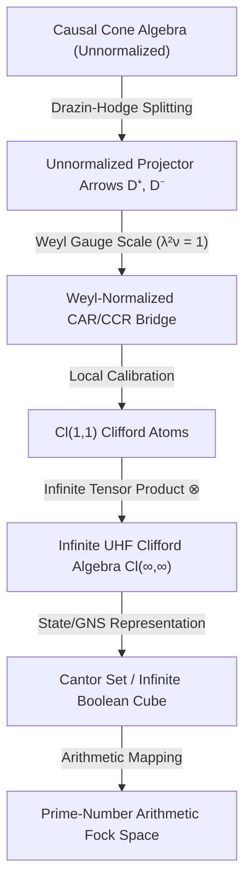

# 233. Weyl Gauge, Clifford Atoms, and Cantor Set Emergence

In the exploration of the causal cone algebra, we discovered that it does not natively manifest as a pure CAR/CCR algebra. Instead, the intrinsic structure constants of the causal geometry deform the commutation relations. To resolve this and normalize the algebraic core, we introduce the **Weyl Gauge**—a scaling method that restores canonical commutation and anticommutation relations, providing the exact mathematical bridge between split-signature Clifford structures and Fock spaces. 

This chapter outlines the formal mechanics of this Weyl normalization and documents how the infinite tensoring of split-signature $Cl(1,1)$ "Clifford atoms" naturally constructs the Cantor set and the prime Boolean-cube lattice.

---

## 1. The Causal Cone & The Need for Weyl Gauge

The unnormalized projector arrows generated by the Drazin-Hodge chiral splitting—namely $D^+ = u^-(D)$ and $D^- = u^+(D)$—satisfy unnormalized relations where the anticommutator (or commutator) is scaled by a metric core factor:

$$D^+ D^- + D^- D^+ = \nu \cdot \mathbb{I}$$

Here, $\nu$ represents the raw metric scale of the unnormalized causal cone algebra. Left uncalibrated, this scale prevents the direct construction of a standard Fock space or the synthesis of unit-scale representation layers.

### The Weyl Resolution
By introducing a Weyl scaling gauge $\lambda \in \mathbb{R}$ satisfying the unit normalization condition:

$$\lambda^2 \nu = 1$$

we scale the unnormalized Drazin-Hodge arrows to their Weyl-normalized counterparts:

$$\tilde{D}^+ = \lambda D^+, \quad \tilde{D}^- = \lambda D^-$$

These Weyl-normalized operators satisfy the exact unit CAR relation:

$$\tilde{D}^+ \tilde{D}^- + \tilde{D}^- \tilde{D}^+ = \lambda^2 (D^+ D^- + D^- D^+) = \lambda^2 \nu \cdot \mathbb{I} = \mathbb{I}$$

This scaling serves as the ultimate calibration step, converting the causal cone's geometric deformations into unit-coherent operators.

---

## 2. Tensoring the $Cl(1,1)$ Clifford Atoms

The split-signature Clifford algebra $Cl(1,1)$ represents the fundamental superalgebraic "atom" of our physical framework. The transition from these individual Clifford atoms to the multi-mode Fock space is achieved through infinite tensoring.

1.  **The Clifford Atom**: Each mode $p$ (typically indexed by prime numbers) is represented by a copy of the split Clifford algebra $Cl(1,1)_p$, which houses a pair of Majorana operators satisfying:
    $$\{c_p, c_q\} = 2\delta_{pq}, \quad \{d_p, d_q\} = -2\delta_{pq}, \quad \{c_p, d_q\} = 0$$
2.  **Infinite Tensoring**: Taking the infinite tensor product of these $Cl(1,1)$ atoms over the prime system:
    $$\mathcal{A} = \bigotimes_{p \in \mathcal{P}} Cl(1,1)_p$$
    constructs the infinite-dimensional Clifford algebra $Cl(\infty, \infty)$ (or the CAR UHF algebra).
3.  **The Cantor Set & Boolean Cube**: The state space (and the associated GNS representation) of this infinite tensor product naturally indexes states via binary occupancy sequences over the primes. This binary occupancy lattice is topologized as the Cantor set (or the infinite Boolean cube):
    $$\Omega = 2^{\mathcal{P}} \cong \text{Cantor Set}$$
    Each point in the Cantor set represents a square-free integer, establishing a direct holographic mapping between split Clifford representations and the prime-number arithmetic Fock space.

---

## 3. The Repo-Facing Dictionary

This mathematical framework maps directly onto the following Lean 4 modules in the repository:

### 1. The Normalization Layer: `WeylNormalizedCARCCRBridge`
*   **File:** [WeylNormalizedCARCCRBridge.lean](file:///home/goutev/repos/info-geometry-lean/lean/InfoGeometry/Canonical/WeylNormalizedCARCCRBridge.lean)
*   **Role:** Formally implements the Weyl scale $\lambda$ and metric core $\nu$ satisfying `lambda_sq_mul_nu_eq_one`. It translates unnormalized `RawCAR` and `RawCCR` relations into unit `IsCARPair` and `IsCCRPair` predicates over the supergraded Fock lane.
*   **Key Witness:** `concreteCl11ScaledCARPair` certifies the local $Cl(1,1)$ Fock algebra with $\lambda = 1, \nu = 1$.

### 2. The Multi-Mode Majorana Algebra: `PrimeMajoranaCAR`
*   **File:** [PrimeMajoranaCAR.lean](file:///home/goutev/repos/info-geometry-lean/lean/InfoGeometry/Arithmetic/PrimeMajoranaCAR.lean)
*   **Role:** Stabilizes the algebraic relations for the prime-indexed Majorana operators. It contains the core algebraic identity $\Pi^2 = (1 - 2N)^2 = 1$ which ensures local parity idempotency.

### 3. The Cantor Set & Boolean-Cube Bridge: `PrimeCantorBooleanCubeBridge`
*   **File:** [PrimeCantorBooleanCubeBridge.lean](file:///home/goutev/repos/info-geometry-lean/lean/InfoGeometry/Arithmetic/PrimeCantorBooleanCubeBridge.lean)
*   **Role:** Connects the multi-mode Majorana Clifford algebra with the finite prime Boolean-cube lattice. It provides the global chirality and Möbius parity equivalence:
    *   `globalMajoranaChirality_eq_neg_one_pow_card_canonical`
    *   `mobius_representedNat_eq_fermionParity_canonical`

---

## 4. Deep Architectural Synthesis

By framing the causal cone algebra through the Weyl gauge, we ensure that the transition from continuous split-signature spacetime geometry to discrete arithmetic Cantor sets is not a heuristic jump, but a rigorous, calibrated algebraic descent. The Weyl scale serves as the precise structure constant regularizer, stabilizing the entire functorial spine of the repository.
