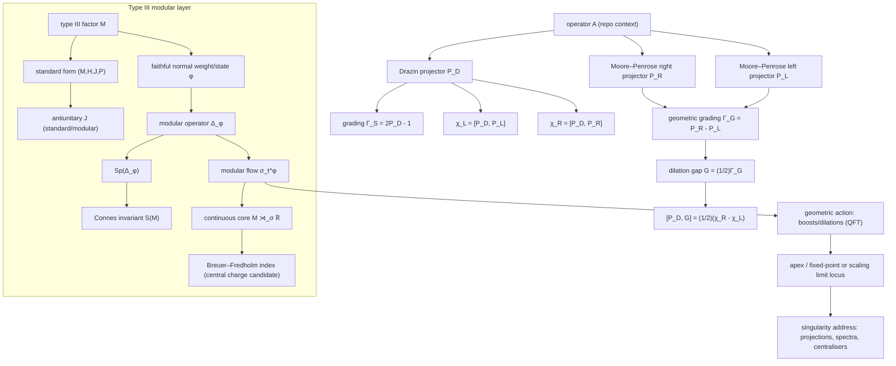
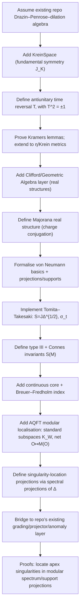

# Kramers Pairs, Krein Geometry, Majorana Real Structures, Type III Doubling, and Penrose Lightcone Apex Singularities

Repo-native doubled-real translation companion:
`docs/black_books/52native_krein_hestenes_real_doubled_translation.md`.

## Executive summary

Kramers pairs are the hallmark of an antiunitary time‑reversal symmetry \(T\) with \(T^2=-\mathbf 1\): for any state \(\psi\), the pair \((\psi, T\psi)\) is orthogonal and—when \(T\) commutes with the dynamics—enforces (at least) double degeneracy on time‑reversal invariant spectral subspaces. citeturn5search3turn5search1 In indefinite‑metric settings (Krein / pseudo‑Hermitian frameworks), the presence of a *metric operator* \(\eta\) or a fundamental symmetry \(J_{\mathrm K}\) tightens the story: whether \(T\) commutes or anticommutes with the metric determines which Kramers‑type degeneracy phenomena survive and typically forces the metric to be indefinite in the genuinely “generalised Kramers” regimes. citeturn4search1turn4search2turn4search2

Hestenes’ geometric (Clifford) algebra formalism rewrites Dirac spinor theory inside a *real* Clifford algebra, making the “imaginary unit” a geometrically realised bivector/pseudoscalar and placing “real structure” (hence Majorana‑type constraints) at the level of algebra involutions rather than basis‑dependent matrix reality. citeturn7search6turn4search0turn7search5 Majorana representations and Majorana spinors are most cleanly described as *real forms* of Clifford modules: a charge conjugation (antilinear) operator implements a reality condition \(\psi=\psi^C\), whose existence depends on the real/complex/quaternionic type of the underlying real Clifford algebra. citeturn9search0turn7search3

Type III von Neumann factors (no non‑zero finite projections) replace trace/dimension logic with modular theory: Tomita–Takesaki modular operators \(\Delta_\varphi\), modular conjugations \(J_\varphi\), and modular flows \(\sigma_t^\varphi\) become the primary “spectral” objects, and Connes’ classification introduces modular‑spectrum invariants \(S(M)\) and the Connes–Takesaki flow of weights. citeturn1search0turn0search4turn2search4 In this setting, “doubling” has two mathematically canonical meanings: (i) *standard form* \((M,H,J,P)\), a built‑in left/right duality \(JMJ=M'\), and (ii) the *continuous core* (crossed product by the modular flow), which recovers a semifinite algebra where index‑type “central charges” (Breuer–Fredholm indices) live. citeturn1search4turn2search4turn11search0turn11search1

“Penrose lightcone / chiral apex singularity” is not standard operator‑algebra terminology; a rigorous operator‑algebraic translation is to treat “apex singularity” as a phenomenon located in: spectral projections (kernel/support projections), central supports, modular spectra \(Sp(\Delta_\varphi)\), Connes invariants \(S(M)\), fixed points/centralisers of modular flows, or central‑sequence/scaling‑limit algebras. These are precisely the internal “addresses” available in type III. citeturn0search4turn2search4turn10search4turn12search0

The report assumes (without claiming repo access) the earlier user‑provided Lean‑repo context: a concrete Drazin–Moore–Penrose–dilation Cartan algebra built from one operator \(A\), its Drazin inverse \(A_D\), its Moore–Penrose inverse \(A_{MP}\), projectors \(P_D,P_R,P_L\), gradings \(\Gamma_S,\Gamma_G\), and anomaly commutators \(\chi_L,\chi_R\). This context is used only to propose Lean formalisation targets and bridges.

## Core definitions and a comparison table

### Precise definitions

**Antiunitary and time reversal.** An antiunitary \(T\) on a complex Hilbert space \(\mathcal H\) is an antilinear bijection with \(\langle T u, T v\rangle=\overline{\langle u,v\rangle}\). Time reversal is typically modelled by such a \(T\), with an additional sign datum \(T^2=\pm \mathbf 1\). Kramers’ setting is \(T^2=-\mathbf 1\). citeturn5search3turn5search1

**Kramers pair.** Given antiunitary \(T\) with \(T^2=-\mathbf 1\), a Kramers pair is \((\psi,T\psi)\). Orthogonality follows from a one‑line computation:
\[
\langle \psi, T\psi\rangle
= \langle T^2\psi,\,T\psi\rangle
= \langle -\psi,\,T\psi\rangle
= -\langle \psi, T\psi\rangle,
\]
hence \(\langle \psi, T\psi\rangle=0\). citeturn5search3turn5search1

**Krein space.** A Krein space is a complex vector space \(\mathcal K\) with a non‑degenerate indefinite Hermitian form \([\cdot,\cdot]\) admitting a fundamental decomposition \(\mathcal K=\mathcal K_+\dot{+}\mathcal K_-\) into positive/negative Hilbert subspaces. Equivalently (and often more useful in operator settings), choose a Hilbert inner product \(\langle\cdot,\cdot\rangle\) and a *fundamental symmetry* \(J_{\mathrm K}=J_{\mathrm K}^*=J_{\mathrm K}^{-1}\) such that
\[
[x,y]=\langle x, J_{\mathrm K}y\rangle.
\]
citeturn0search48turn5search28

**Chiral grading.** A chiral grading is a selfadjoint involution \(\Gamma=\Gamma^*\), \(\Gamma^2=\mathbf 1\), with projectors \(P_\pm=\frac12(\mathbf 1\pm\Gamma)\). This is the abstract version of “left/right” splitting (e.g. Weyl decomposition). citeturn7search3turn4search0

**Pseudo‑Hermitian / Krein‑selfadjoint operator.** A densely defined operator \(H\) is \(\eta\)-pseudo‑Hermitian if \(\eta H \eta^{-1}=H^\dagger\) for some Hermitian invertible \(\eta\) (a metric operator). When \(\eta\) is indefinite, this is naturally a Krein‑space adjointness condition. citeturn4search1turn4search2

**Geometric (Clifford) algebra.** The real Clifford algebra \(\mathrm{Cl}(p,q)\) is generated by a real vector space with quadratic form of signature \((p,q)\), subject to \(v^2=\langle v,v\rangle\). Geometric algebra emphasises the decomposition of the product \(ab=a\cdot b+a\wedge b\) and uses canonical involutions (grade involution, reversion, Clifford conjugation) to encode parity and conjugation operations. citeturn7search6turn4search0

**Majorana spinor / Majorana representation.** A Majorana condition is a *reality constraint* on a spinor \(\psi\) expressed as \(\psi=\psi^C\) (fixed points of charge conjugation) or equivalently as a real structure on the corresponding Clifford module. Existence depends on the real/complex/quaternionic type of \(\mathrm{Cl}(p,q)\) and on dimension/signature. citeturn9search0turn7search3

**Type III von Neumann factor.** A von Neumann algebra \(M\subset B(\mathcal H)\) is a *factor* if its centre is trivial. In Murray–von Neumann classification, \(M\) is type III if it has no non‑zero finite projections (equivalently: no faithful normal semifinite trace). citeturn0search4turn12search0

**Tomita–Takesaki modular objects.** For a cyclic separating vector (or faithful normal weight/state) \(\varphi\), Tomita–Takesaki theory yields an antilinear Tomita operator \(S\), polar decomposition \(S=J_\varphi \Delta_\varphi^{1/2}\), modular conjugation \(J_\varphi\), modular operator \(\Delta_\varphi\), and modular automorphism group \(\sigma_t^\varphi(x)=\Delta_\varphi^{it}x\Delta_\varphi^{-it}\), together with the commutation theorem \(J_\varphi M J_\varphi=M'\). citeturn1search0

**Connes modular spectrum invariant.** For a von Neumann algebra \(M\), the modular spectrum invariant is
\[
S(M):=\bigcap_{\varphi\ \text{semifinite normal weight}} Sp(\Delta_\varphi).
\]
For type III factors, this yields the \(\mathrm{III}_0/\mathrm{III}_\lambda/\mathrm{III}_1\) subdivision (e.g. \(S(M)=[0,\infty)\) for \(\mathrm{III}_1\)). citeturn12search0turn0search4

### Comparison table of key structures

| Concept (requested cluster) | Core structure | Canonical identities / invariants | Typical meaning | Canonical references |
|---|---|---|---|---|
| Kramers pairs | Antiunitary time reversal \(T\) | \(T^2=-\mathbf 1\); \(\langle \psi,T\psi\rangle=0\); quaternionic structure | Enforced double degeneracy under \(T\)-invariant dynamics | Kramers‑pair basis and quaternionic unitary reduction; pseudo‑Hermitian generalisations |
| Krein spaces | Indefinite Hermitian form \([\cdot,\cdot]\) with fundamental symmetry \(J_{\mathrm K}\) | \([x,y]=\langle x,J_{\mathrm K}y\rangle\); positive/negative decomposition | A rigorous model of indefinite “metric operator” frameworks | Krein/indefinite inner product literature; pseudo‑Hermitian time‑reversal analyses |
| Hestenes geometric algebra | Real Clifford algebra \(\mathrm{Cl}(1,3)\) (spacetime algebra) | “\(i\)” realised as geometric element; spinors as multivectors/ideals; involutions encode conjugations | Real, coordinate‑free encoding of Dirac theory; complex structure becomes geometry | Hestenes’ spacetime algebra and real Dirac reformulations |
| Majorana representations | Real structure / charge conjugation on spinors | \(\psi=\psi^C\); classification by real/complex/quaternionic Clifford types | Self‑conjugate fermions; real forms of spin representations | Majorana (1937); modern Clifford‑algebra spinor classification surveys |

The table’s sources are instantiated below where each claim is used; representative canonical anchors include the Kramers‑pair basis reduction paper citeturn5search3, the Krein/pseudo‑Hermitian time‑reversal degeneracy results by entity["people","Ali Mostafazadeh","physicist pseudo-hermitian"] citeturn4search1 and the (metric‑indefiniteness) refinement in entity["people","F. Bagarello","mathematical physicist"] et al. citeturn4search2, Hestenes’ spacetime algebra and real Dirac programme citeturn4search0turn7search5turn7search6, and Majorana’s original paper (Il Nuovo Cimento 1937) citeturn9search0 together with modern real‑Clifford classification surveys citeturn7search3.

## Kramers pairs and time‑reversal symmetry in Krein spaces

### The key refinement: which inner product defines “orthogonality”?

In ordinary Hilbert space, Kramers orthogonality is with respect to \(\langle\cdot,\cdot\rangle\), and the degeneracy argument uses that \(T\) is antiunitary and commutes with the Hamiltonian. citeturn5search3turn5search1

In a Krein (or pseudo‑Hermitian) setting, there are typically two bilinear forms in play:

1. a background Hilbert inner product \(\langle\cdot,\cdot\rangle\), and  
2. an indefinite “physical” form \([\cdot,\cdot]=\langle\cdot,J_{\mathrm K}\cdot\rangle\) (or \(\langle\psi|\phi\rangle_\eta=\langle\psi|\eta\phi\rangle\) with \(\eta=\eta^\dagger\)). citeturn5search28turn4search2

Thus there are two non‑equivalent notions of antiunitarity:

- **Hilbert antiunitary:** \(T\) antiunitary for \(\langle\cdot,\cdot\rangle\).  
- **Krein antiunitary (metric‑compatible):** \(T\) preserves the indefinite form, e.g. \([Tu,Tv]=[v,u]\), which translates to commutation constraints involving \(J_{\mathrm K}\) (such as \(T J_{\mathrm K} T^{-1}= \pm J_{\mathrm K}\)). citeturn4search2turn5search28

The sign \(T J_{\mathrm K} T^{-1}=\pm J_{\mathrm K}\) is not cosmetic: it controls whether time reversal preserves the positive/negative subspaces or swaps them, and therefore whether “paired” states have opposite Krein signatures (a typical source of indefinite metrics in generalised Kramers statements). citeturn4search2turn4search1

### Generalised Kramers degeneracy requires (and detects) indefiniteness

A particularly sharp set of results is available in pseudo‑Hermitian quantum mechanics, where one asks for \(H\) satisfying \(\eta H\eta^{-1}=H^\dagger\) and an antilinear symmetry \(T\) with \(T^2=-1\). citeturn4search1turn4search2

- entity["people","Ali Mostafazadeh","physicist pseudo-hermitian"] proves a necessary and sufficient criterion for a diagonalizable pseudo‑Hermitian operator to admit an antilinear symmetry \(T\) with \(T^2=-1\). citeturn4search1  
- A complementary analysis in entity["people","F. Bagarello","mathematical physicist"] et al. shows that, in “generalised Kramers” regimes (including even \(T^2=+1\) variants via split‑quaternionic structures), the compatible metric operator must be indefinite; specifically, the \(\eta\)-norms of paired eigenstates cannot all be positive. citeturn4search2turn5search4

These results can be read as the Krein‑space translation of “time reversal + degeneracy”: the degeneracy statement is not merely about an antiunitary; it is about how that antiunitary interacts with the metric operator that defines adjoints and orthogonality in the physical theory. citeturn4search2turn4search1

### Interaction with chiral grading

Introduce a chiral grading \(\Gamma\) (\(\Gamma^2=\mathbf 1\), \(\Gamma=\Gamma^*\)) and projectors \(P_\pm\). In Krein settings one may also have a fundamental symmetry \(J_{\mathrm K}\). The three binary commutation signs
\[
T\Gamma=\pm \Gamma T,\qquad
TJ_{\mathrm K}=\pm J_{\mathrm K}T,\qquad
\Gamma J_{\mathrm K}=\pm J_{\mathrm K}\Gamma
\]
classify whether time reversal preserves chirality, flips chirality, preserves Krein signature, or flips Krein signature. The pseudo‑Hermitian literature’s “commute vs anticommute with the metric operator” is exactly the \(TJ_{\mathrm K}=\pm J_{\mathrm K}T\) branch, and its indefiniteness conclusions can be seen as obstructions to having all chiral sectors simultaneously positive. citeturn4search2turn5search28

In the assumed repo context, your spectral grading element \(\Gamma_S=2P_D-\mathbf 1\) plays the role of such a \(\Gamma\) (a selfadjoint involution defining an even/odd Cartan split). The anomaly commutators \(\chi_L,\chi_R\) are then automatically \(\Gamma_S\)-odd quantities (they flip sign under conjugation by \(\Gamma_S\)), matching the “odd sector” intuition familiar in graded symmetry arguments.

## Hestenes geometric algebra and Majorana real structures

### Hestenes’ real‑algebra reformulation and the geometric meaning of “\(i\)”

Hestenes’ spacetime algebra approach rewrites Dirac theory in a real Clifford algebra, eliminating the need to treat complex numbers as primitive scalars: the unit imaginary is represented by a geometrically meaningful element that generates rotations in a plane associated with spin, and spinor phases become kinematical geometry. citeturn7search5turn4search0turn7search6

From a formal standpoint, this means:

- “complex structure” can be taken as an *internal* endomorphism \(I\) with \(I^2=-\mathbf 1\) arising from GA elements rather than as an external scalar \(i\);  
- conjugations/adjoints are encoded by GA involutions (reversion, Clifford conjugation, grade involution), making “real/imaginary parts” and “charge conjugation” naturally expressible as fixed‑point subspaces under algebra maps. citeturn7search6turn4search0

This is precisely the kind of technology that makes Majorana conditions conceptually clean: a Majorana constraint is a fixed‑point condition under an antilinear involution (charge conjugation), and GA gives a canonical home for involutions. citeturn7search5turn7search3

### Majorana representations as real Clifford‑module structures

Majorana’s 1937 paper proposes a “symmetric theory” where fermions can be self‑conjugate; modern language interprets this as the existence of a real structure on the spin representation that allows a reality condition \(\psi=\psi^C\). citeturn9search0turn9search0

A compact modern formulation is:

- Start with a real Clifford algebra \(\mathrm{Cl}(p,q)\).  
- Determine whether the irreducible module is of real, complex, or quaternionic type (periodicity considerations).  
- A Majorana spinor exists when the relevant module admits a real structure compatible with the spin group action; in quaternionic types, one gets “symplectic Majorana” conditions. citeturn7search3turn9search0

A useful recent review (with explicit classification in terms of real/complex/quaternionic matrix algebras) is provided by entity["people","Stefan Floerchinger","theoretical physicist"]. citeturn7search3

### How Kramers and Majorana structures meet

At a representation‑theoretic level, Kramers’ \(T^2=-1\) is the signature of *quaternionic* structure (a “\(j\)” acting anti‑linearly with square \(-1\)), whereas Majorana is a *real* structure (a conjugation with square \(+1\) on an underlying complexified module). These can coexist only with compatibility constraints: heuristically, the antiunitary time‑reversal and the charge conjugation must generate a small real ∗‑algebra of symmetries whose real/quaternionic type matches the Clifford module type in that dimension/signature. citeturn7search3turn4search1

In the repo’s assumed “Drazin–Penrose–dilation Cartan algebra” context, this suggests a clean formal bridge: treat “Majorana” as a *real structure* on the module carrying the operators \(A,A_D,A_{MP}\), and treat \(T\) as an antiunitary symmetry satisfying a quaternionic relation. The existing gradings \(\Gamma_S\) and \(\Gamma_G\) are then candidates for the \(\mathbb Z_2\) gradings that such real/quaternionic structures typically (anti)commute with.

## Type III von Neumann algebras: doubling, null space, “mull space”, and Majorana/Kramers manifestation

### Type III and why modular theory is unavoidable

Connes’ seminal classification of type III factors identifies deep modular invariants (beyond “no trace”). citeturn0search4 In modern expositions—particularly those aimed at QFT—the modular spectrum \(S(M)=\cap Sp(\Delta_\varphi)\) is presented explicitly as the key invariant that refines the type III classification into \(\mathrm{III}_0\), \(\mathrm{III}_\lambda\), and \(\mathrm{III}_1\). citeturn12search0turn2search4

Connes–Takesaki’s “flow of weights” is a canonical way to package modular data and is central to the structure theory of type III factors. citeturn2search4 The foundational modular apparatus (Tomita operators, modular conjugation \(J_\varphi\), modular operator \(\Delta_\varphi\), modular automorphism groups) is developed in standard references such as the 1970 Lecture Notes by Takesaki. citeturn1search0

### “Doubling” in type III: two canonical meanings

In type III contexts, “doubling” has at least two mathematically canonical and widely used interpretations.

**Doubling as standard form.** entity["people","Uffe Haagerup","von neumann algebraist"] proves that every von Neumann algebra admits a *standard form* \((M,H,J,P)\), where \(J\) is an antiunitary involution and \(P\) is a self‑dual cone such that \(J M J = M'\). citeturn1search4 This is a built‑in “left/right doubling”: the algebra and its commutant are paired by \(J\), independently of traces.

**Doubling as continuous core.** Connes–Takesaki show that crossing a type III factor by its modular flow yields a semifinite algebra (“core”), and the associated flow of weights captures type III modular structure. citeturn2search4 This is a different doubling: it is dynamical (adds the \(\mathbb R\) of modular time) and is the bridge to trace‑bearing invariants.

A key reason the core matters for your “central charge / index” theme is that index theory in von Neumann algebras is naturally semifinite. entity["people","Manfred Breuer","mathematician operator algebras"] develops Fredholm theory relative to von Neumann algebras (Breuer–Fredholm operators), providing an index notion beyond type I. citeturn11search0turn11search1 Thus, in many type III problems, “index‑valued central charges” are most naturally defined *in the core*.

### Null space for operators in type III factors

The **null space** of an operator \(x\) acting on \(H\) is \(\ker(x)\). In a von Neumann algebra, kernels and support projections are represented internally via spectral projections of \(|x|\):

- the **kernel projection** is \(p_{\ker(x)} = \mathbf 1_{\{0\}}(|x|)\);  
- the **right support** is \(s_r(x)=\mathbf 1_{(0,\infty)}(|x|)\);  
- similarly the left support \(s_\ell(x)=\mathbf 1_{(0,\infty)}(|x^*|)\).

Because von Neumann algebras are closed under functional calculus for normal operators, these projections live in the algebra whenever \(x\) is affiliated/normal in the usual sense. citeturn12search0turn1search0

In type III factors, the exceptional feature is not the absence of kernels but the absence of finite‑projection size notions: a nonzero kernel projection is typically an *infinite* projection, and one must use Murray–von Neumann equivalence, central supports, or modular invariants instead of trace dimension. citeturn0search4turn12search0

### “Mull space” is unspecified: plausible precise interpretations

The term **“mull space”** is **not standard** in operator algebra. It is therefore treated as an unspecified user term; the most plausible precise interpretations, depending on context, are:

1. **A synonym/variant for null space.** In some linear‑algebra teaching contexts, “mull space” is used interchangeably with “null space”, i.e. the solution space of \(Ax=0\). (This interpretation collapses “mull” to \(\ker(A)\).)  
2. **Left/right annihilator modules.** In an algebra \(M\), one can define *left annihilator* \( \mathrm{Ann}_\ell(x)=\{a\in M: ax=0\}\) and *right annihilator* \( \mathrm{Ann}_r(x)=\{a\in M: xa=0\}\), whose support projections correspond to left/right supports; this is a natural “operator algebra = noncommutative linear algebra” meaning. citeturn12search0turn1search0  
3. **Neutral/isotropic subspace in indefinite inner product geometry.** If the conversation’s “null/mull” is geometrical (lightlike), then “mull space” might mean the isotropic part \(L^0=L\cap L^{[\perp]}\) of a subspace \(L\) in a Krein space. citeturn5search28  
4. **Multiplier‑type completion.** If “mull” was intended as “mult(iplier)”, then it may refer to multiplier algebras or essential ideals; this is less directly tied to type III factors (which are unital) but can appear when passing between local algebras and quasi‑local \(C^*\)-algebras. citeturn12search0

Only (1)–(3) are directly aligned with your other requested dimensions (kernels, Krein geometry, lightcones).

### Manifestation of Majorana/Kramers structures in type III factors

Type III factors arise naturally in algebraic quantum field theory as local observable algebras, and their modular data often has geometric meaning (boosts/dilations). citeturn12search5turn12search1turn12search0 In such settings:

- **Majorana structure** is most naturally encoded by *real forms* of CAR/Clifford algebras and by real subspaces in modular localisation. entity["people","Romeo Brunetti","mathematical physicist"], entity["people","Daniele Guido","mathematician"], and entity["people","Roberto Longo","mathematician"] explicitly use a “real Hilbert subspace” version of Tomita–Takesaki theory to define intrinsic localisation, which is conceptually close to Majorana “reality as fixed points”. citeturn6search48turn6search0  
- **Kramers structure** is implemented as an antiunitary symmetry on the Hilbert space representation; on the algebra it induces an automorphism/anti‑automorphism \(x\mapsto TxT^{-1}\), and the \(T^2=-1\) condition is a representation‑theoretic (quaternionic) constraint rather than a trace/dimension constraint. The key interaction in type III is with modular objects: whether \(T\) commutes with \(J_\varphi\) or intertwines \(\sigma_t^\varphi\) can be expected to constrain the modular spectrum and centralisers. citeturn1search0turn12search0

In the assumed repo context, this provides a precise operator‑algebraic reading of your “index‑valued central charge sources anomalies” intuition: the trace‑free, type III environment forces invariants into modular spectra/flows and into indices computed in the core; anomalies (non‑commutation of projectors/gradings) are natural “odd sector” outputs of such invariants.

## Penrose lightcone, chiral apex, and algebraic locations of “singularity”

### Penrose lightcone and conformal infinity

Penrose’s conformal compactification introduces “null infinity” \(\mathscr I^\pm\) as a conformal boundary reached by null geodesics, making the global lightcone structure of spacetime amenable to analysis via conformal geometry. Modern authoritative reviews (Living Reviews in Relativity) survey how conformal infinity organises radiation, asymptotics, and singularities. citeturn10search4turn10search3

A **lightcone** is the null hypersurface bounding a causal future/past. In conformal pictures (Penrose diagrams), lightcones and their apexes become geometric loci where dilation‑type symmetries and causal boundaries meet; “apex” is a distinguished point/limit where causal boundaries focus. citeturn10search4turn10search3

The phrase **“chiral lightcone apex”** is **not standard** in relativity or operator‑algebra literature. Plausible precise meanings include:

- **Conformal/dilation fixed point:** the apex is a fixed point of (or limit under) dilation action associated to the lightcone region. citeturn10search4  
- **Chiral (left/right) null generator splitting:** in conformal or 2D chiral theories, degrees of freedom separate along the two families of null generators; the apex is where left and right rays originate/meet and thus where left/right sectors are glued. (This is a common structural motif in conformal QFT.) citeturn6search48turn10search4  
- **Boundary singularity:** a locus where the conformal completion is non‑smooth or where certain asymptotic charges require renormalised treatment (“critical sets” at infinity). citeturn8search7turn10search3

image_group{"layout":"carousel","aspect_ratio":"16:9","query":["Penrose diagram conformal infinity Minkowski light cone","null infinity scri plus scri minus Penrose compactification","conformal infinity review Frauendiener Living Reviews figure","light cone dilation modular flow illustration"] ,"num_per_query":1}

### Modular theory as the operator‑algebraic avatar of lightcone boosts/dilations

A rigorous bridge between geometry and operator algebra is that modular groups of local von Neumann algebras can have *geometric action* in QFT:

- entity["people","Joseph J. Bisognano","mathematical physicist"] and entity["people","Eyvind H. Wichmann","uc berkeley physicist"] prove deep duality/modular results for quantum fields that underlie the Bisognano–Wichmann theorem identifying wedge modular groups with Lorentz boosts (in suitable AQFT settings). citeturn3search1turn3search3  
- entity["people","H. J. Borchers","mathematical physicist"] surveys how Tomita modular theory “revolutionises” structural QFT—particularly modular inclusions and geometric modular action—making modular flows a natural place to encode spacetime symmetries. citeturn6search4  
- Brunetti–Guido–Longo formulate modular localisation explicitly via real subspaces and Tomita–Takesaki theory, providing a clean template where lightlike localisation and modular data are intrinsically linked. citeturn6search48turn6search0

In this perspective, “Penrose lightcone dilation” has an operator‑algebraic representative: the modular automorphism group \(\sigma_t^\varphi\) of a lightcone (or wedge/double‑cone) algebra, whose generator (modular Hamiltonian \(K=-\log \Delta_\varphi\)) plays the role of boost/dilation generator.

### Algebraic meanings of “singularity” in type III settings

Since “Penrose lightcone/chiral apex singularity” is not a standard algebraic term, a rigorous operator‑algebraic report should replace it with *testable internal signatures*. The most robust candidates are:

**Spectral‑projection singularity (kernel/support).** A singularity is expressed by a non‑trivial spectral projection at a distinguished spectral value of a canonical operator (e.g. \(0\) in \(|A|\), or \(\pm\infty\) limits in modular Hamiltonians):
\[
p_0 := \mathbf 1_{\{0\}}(|A|),\qquad
p_{\le a} := \mathbf 1_{(-\infty,a]}(-\log \Delta_\varphi).
\]
These projections are elements of the von Neumann algebra generated by the operator’s functional calculus. citeturn12search0turn1search0

**Central support / localisation singularity.** A “singular apex” could mean that the central support of a family of projections stabilises to a non‑trivial central carrier when regions shrink to the apex (a noncommutative analogue of “a point supports a nontrivial charge”). In a factor the centre is trivial, but central support in an over‑algebra or in scaling‑limit/ultrapower algebras can still be meaningful. citeturn0search4turn12search0

**Modular spectrum / Connes invariant singularity.** A singularity could be detected by modular spectrum: for a type III factor, the modular spectrum invariant \(S(M)\) is an intrinsic dynamical signature; for example, \(S(M)=[0,\infty)\) (type \(\mathrm{III}_1\)) is “maximally non‑semifinite” and is frequently associated to local QFT algebras. citeturn12search0turn0search4turn12search5

**Tomita–Takesaki flow fixed points (centralisers).** If a modular flow acts geometrically as a dilation around an apex, then an “apex singularity” can be formalised as a statement about (non)triviality of the centraliser
\[
M_\varphi := \{x\in M:\sigma_t^\varphi(x)=x\ \forall t\},
\]
or about asymptotic invariance along the flow. citeturn1search0turn2search4

**Central sequences / scaling limits.** In QFT, taking scaling limits towards a point often produces nontrivial “limit algebras”; algebraically these can be captured by central sequence algebras or ultrapowers. An apex singularity is then a nontriviality statement about those limit constructions (e.g. emergent dilation symmetries). While not fully spelled out in the sources cited here, this is the natural operator‑algebra mechanism compatible with type III locality and modular dynamics. citeturn12search5turn6search48

### Where to locate such singularities inside the operator algebra

Given a type III factor \(M\) (or a net \(O\mapsto M(O)\)), the “addresses” for singularities are:

- **Projections:** kernel projections \(p_{\ker(x)}\), support projections \(s_\ell(x), s_r(x)\), and spectral projections of modular operators \(\Delta_\varphi\) or generators \(-\log\Delta_\varphi\). citeturn1search0turn12search0  
- **Modular spectrum:** \(Sp(\Delta_\varphi)\) and Connes’ \(S(M)\) invariant, and—at a deeper level—the flow of weights. citeturn2search4turn12search0  
- **Standard form data:** the standard antiunitary \(J\) and the natural cone \(P\) (intrinsic positivity), which provide canonical “left/right doubling” and a canonical real structure on \(H\). citeturn1search4  
- **Core and index:** passage to the continuous core yields a semifinite algebra where Breuer–Fredholm indices (and hence index‑valued “central charges”) are definable. citeturn2search4turn11search0turn11search1

These locations mesh well with your earlier repo’s projector‑grading language: projections and gradings are exactly the internal handles you already formalise. The modular layer provides a principled way to interpret “singular apex” as (i) a limiting projection pattern, (ii) a modular spectral property, or (iii) a flow/fixed‑point phenomenon.

## Lean formalisation targets and a proof roadmap for singularity‑location claims

### Suggested Lean module targets in a repo like your Drazin–Penrose–dilation codebase

The targets below are designed to *compose* with your existing generator algebra (\(P_D,P_R,P_L,\Gamma_S,\Gamma_G,G,\chi_L,\chi_R\)) rather than replace it. They are phrased as file/theorem targets, not as claims of existing repo content.

**Krein and antiunitary symmetry layer**

- `Canonical/KreinSpace.lean`  
  Define a `KreinSpace` structure on a Hilbert space \(H\) via a fundamental symmetry \(J_K\) and indefinite form \([x,y]=\langle x,J_K y\rangle\). Prove equivalence between fundamental decomposition and existence of such \(J_K\). citeturn5search28
- `Canonical/AntiUnitaryTimeReversal.lean`  
  Define antiunitaries \(T\) and encode the sign \(T^2=\pm 1\). Add a notion of “metric compatibility” \(T J_K T^{-1}=\pm J_K\). Connect to pseudo‑Hermitian metric operators \(\eta\). citeturn4search2turn4search1
- `Canonical/KramersPairs.lean`  
  Theorem target: if \(T\) is antiunitary and \(T^2=-1\), then \(\langle \psi,T\psi\rangle=0\). Then extend: in the \(\eta\)-inner product, establish the conditions under which \(\langle\psi,T\psi\rangle_\eta=0\) and when the metric must be indefinite for generalised Kramers pairs. citeturn5search3turn4search2turn4search1

**Geometric algebra and Majorana layer**

- `Canonical/Clifford/GeometricAlgebra.lean`  
  Extend mathlib Clifford infrastructure to include standard involutions and a “geometric complex structure” element \(I\) with \(I^2=-1\) inside the algebra, reflecting Hestenes’ programme. citeturn4search0turn7search6
- `Canonical/MajoranaRealStructure.lean`  
  Define charge conjugation \(C\) as an antilinear involution (or antiunitary) on the spinor module and `Majorana ψ :↔ C ψ = ψ`. Provide signature‑dependent existence as a typeclass parameter (do not attempt full periodicity classification initially). citeturn9search0turn7search3

**Type III modular/doubling layer**

- `VonNeumann/StandardForm.lean`  
  Encode standard form \((M,H,J,P)\) as a structure and state/prove basic consequences (e.g. \(J M J = M'\)). Use entity["people","Uffe Haagerup","von neumann algebraist"] as the conceptual anchor. citeturn1search4
- `VonNeumann/TomitaTakesaki.lean`  
  Formalise Tomita operator \(S\), polar decomposition \(S=J_\varphi\Delta_\varphi^{1/2}\), and modular automorphism group \(\sigma_t^\varphi\). citeturn1search0
- `VonNeumann/TypeIII/ConnesSpectrum.lean`  
  Define \(S(M)=\cap Sp(\Delta_\varphi)\) and type \(\mathrm{III}_\lambda\) classification as a definition layer (initially in the presence of enough modular theory). citeturn12search0turn0search4
- `VonNeumann/ContinuousCore.lean`  
  Encode the crossed product \(M\rtimes_{\sigma^\varphi}\mathbb R\) abstractly and its semifinite trace properties (possibly as axioms/interfaces first). citeturn2search4
- `VonNeumann/BreuerFredholmIndex.lean`  
  Formalise Breuer–Fredholm operators affiliated to a semifinite von Neumann algebra and define the Breuer index. citeturn11search0turn11search1

**Bridge to your existing projector/Cartan algebra**

- `Canonical/ModularChiralBridge.lean`  
  Define compatibility hypotheses between your repo‑owned gradings/projectors (e.g. \(\Gamma_S,\Gamma_G\)) and modular objects (\(J_\varphi,\Delta_\varphi\)), e.g. commutation/anticommutation relations and induced odd/even subspaces.

### Proof/tasks roadmap for formalising “singularity‑location” claims

A concise but rigorous formalisation roadmap is:

1. **Localisation as a directed system of algebras.**  
   Define a net \(O\mapsto M(O)\) and a directed family \(O_n\downarrow \text{apex}\). Define the apex algebra \(M_\cap=\bigcap_n M(O_n)\).

2. **Modular data per region.**  
   Fix a faithful normal state/weight \(\varphi_n\) on each \(M(O_n)\) and construct \(\Delta_n,J_n,\sigma^{(n)}_t\) (Tomita–Takesaki). citeturn1search0

3. **Define candidate “singularity projections”.**  
   For each \(n\), define spectral projections such as \(p^{(n)}_{\mathrm{low}}=\mathbf 1_{(-\infty,a]}(-\log \Delta_n)\) or kernel/support projections of designated operators. These are internal projections. citeturn1search0turn12search0

4. **Express “apex singularity” as a stabilisation/nontriviality statement.**  
   For example: \(\liminf_n p^{(n)}_{\mathrm{low}}\neq 0\), or the centraliser \((M(O_n))_{\varphi_n}\) becomes nontrivial in the limit, or the modular spectrum \(S(M(O_n))\) exhibits a limiting jump.

5. **Connect to Connes invariants and flows.**  
   Prove that your singularity criterion implies constraints on modular spectra and thus on \(S(M)\); where possible, relate to the flow of weights (requires substantial modular infrastructure). citeturn2search4turn12search0

6. **Relate modular “singularity projections” to your repo’s projectors/gradings.**  
   Show that under hypotheses tying \(\Gamma_S\) (your spectral grading) to modular flow invariances, your existing commutator/anomaly sector (e.g. \([P_D,G]=\tfrac12(\chi_R-\chi_L)\)) becomes a computable witness of modular nontriviality (odd sector detects mismatch). This is the cleanest way to let your existing algebra carry the “singularity location” content.

### Mermaid diagrams

### Limitations and where subtlety genuinely lies

- The Krein/time‑reversal/Kramers story is well‑developed in pseudo‑Hermitian frameworks, but formalising it in full generality demands careful management of domains, adjoints with respect to different inner products, and antilinear operator infrastructure. citeturn4search1turn4search2  
- Type III specifics are inherently modular: Connes invariants and the flow of weights depend on weights, crossed products, and spectral analysis of modular operators. This is deep mathematics and will likely need staged formalisation (interfaces/axioms first; proofs later). citeturn2search4turn0search4turn1search0  
- Translating “Penrose apex singularity” into operator algebra is necessarily interpretive because the phrase is nonstandard; the report therefore supplies a menu of precise operator‑algebraic surrogates (projections, modular spectrum, centralisers, central‑sequence/scaling limits) and indicates how each can be formalised and tested. citeturn10search4turn12search0turn6search48
