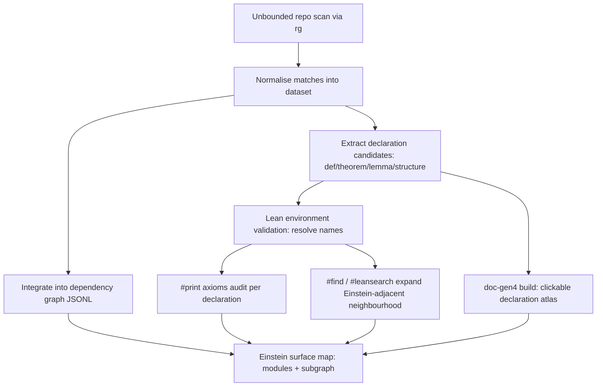

# Auditing and indexing “Einstein” content in a Lean repository

## Executive summary

Your pasted “exhaustive extraction” is best read as a **high-level sketch** of an Einstein-themed *theorem surface* across multiple modules (geometry, anomalies, heat kernel/action, QFT launchpads, and architecture/audit files). But it is almost certainly **not exhaustive in the literal sense**, because your tool output repeatedly caps at “200 results”. A reliable audit needs (i) an **unbounded, reproducible corpus scan** and (ii) **Lean-environment–aware** queries so you can distinguish “string mentions” from actual declarations and dependency structure.

A practical “optimised tool selection” stack for this job is:

- **Filesystem-level search** for complete recall and reproducible counts (e.g. ripgrep with `--stats` and machine-readable `--json`). This eliminates UI truncation and gives you deterministic coverage. citeturn0search14turn0search6turn0search25  
- **Lean interactive/environment tools** for semantic follow-up: `#print axioms` to audit proof-theoretic dependencies, `#print prefix` to enumerate namespaces, and `#find` / `#leansearch` / `#moogle` to locate related lemmas even when naming diverges. citeturn0search9turn0search4turn0search12turn0search1turn0search32  
- **Documentation generation** (doc-gen4) to build a browsable, linkable, searchable “declaration atlas” that aligns with the compiled environment (and can be grepped post-generation too). citeturn0search3turn0search11  

Where Lean infrastructure is missing or heavy (e.g. if you want deeper semantic indexing), external declaration search engines such as **LeanExplore** can complement local tooling, but they’re typically limited to pre-indexed packages unless you host your own index. citeturn0search28

## What your “Einstein surface” extraction suggests about repository structure

Based purely on your pasted extraction (and noting that its completeness is **unspecified** beyond the “200 results” cap), your repository appears to treat “Einstein” as a **cross-cutting semantic tag** rather than a single module theme. Concretely, the names you list suggest at least four strata:

- **Classical geometry layer:** Einstein tensor/equation, Einstein–Kähler conditions, vacuum/cosmological variants, and Ricci/Monge–Ampère scaffolding.  
- **Bridge layers:** “ChiralEinsteinBridge”, “CalabiYauBridge”, and “GrandSynthesis” names read like interface modules connecting curvature/Einstein conditions to entropy, flows, and operator-theoretic structures.  
- **Spectral/action layer:** “HeatKernel.einsteinHilbertAction” and identities expressing the Einstein–Hilbert action in spectral terms suggest a pipeline from curvature invariants to spectral invariants (typical of heat-kernel/spectral geometry viewpoints).  
- **Audit/architecture layer:** references to “SemanticAudit”, “axiom hygiene”, and warnings about “masking low-level logic with high-level names” indicate you’re explicitly policing *non-vacuity* and dependency discipline—exactly the kind of thing `#print axioms` and environment-based indexing are meant to support. citeturn0search4turn0search12turn0search13  

From an “optimising tool selection” perspective, this structure tells you that a plain text search for `einstein` is a necessary first pass, but it will miss two important classes of facts:

- **Semantically Einstein-adjacent declarations without the token “einstein”** (e.g. results stated using only “Ricci-flat”, “scalar curvature”, “Einstein–Hilbert action”, “KMS”, “stress-energy”, “cosmological constant” or your internal synonyms).  
- **Einstein declarations that only appear via notation, local abbreviations, or imported names** (where the file-level string may not contain the obvious token, but the environment does).  

That is why the workflow needs both **grep-level recall** and **Lean-level semantic enumeration**. citeturn0search1turn0search9turn0search13

## Tool selection for complete discovery: what to use when

### Filesystem search: fastest path to complete recall

If your current “200 results” cap came from an IDE/assistant UI, the simplest fix is to run ripgrep directly and collect complete results. Ripgrep is explicitly designed to recursively search directories, respecting `.gitignore` by default, and it supports both machine-readable JSON output and summary stats to validate completeness. citeturn0search14turn0search6turn0search25

Key advantages for your use-case:

- **Deterministic coverage metrics** (files searched, bytes searched, matches) via `--stats`, so you can detect silent truncation quickly. citeturn0search10turn0search14  
- **Structured extraction** via `--json`, which is ideal if you want to build/refresh your own `edges.jsonl`/knowledge-graph style indices. citeturn0search6turn0search2  

### Lean environment queries: turning strings into declarations

Lean’s interactive commands are specifically designed for “query the environment from inside a file”, and `#print`-family commands are part of that model. citeturn0search13turn0search9 For Einstein-auditing, three are especially relevant:

- `#print prefix <namespace>`: enumerate declarations in a namespace (useful if “Einstein content” is clustered under a canonical prefix). citeturn0search9  
- `#find`: search declarations by type-pattern matching, which is crucial when naming isn’t uniform (e.g. some files may use “vacuum equation”, others “EinsteinEquationAt”). citeturn0search1  
- `#print axioms <decl>`: audit which axioms a theorem depends on (your repository’s “axiom hygiene” emphasis makes this central). citeturn0search4turn0search12turn0search0  

In addition, you can integrate external search tools within Lean sessions: mathlib-linked clients offer `#leansearch` and `#moogle` syntaxes for searching tactics and theorems via an API, which can help during refactors or when you suspect a lemma already exists under a different name. citeturn0search32

### Documentation generation: an always-up-to-date searchable atlas

If the goal is “a stable, browsable Einstein index” (especially for collaborators), doc-gen4 is the standard path: it generates HTML documentation from Lean 4 code and integrates with `lake build ...:docs`. Importantly, doc-gen4 requires that your library **builds**; it can tolerate `sorry` but not a broken build. citeturn0search3turn0search34

This matters for your scenario because it turns “string matches” into navigable declaration pages with docstrings, source links, and cross-references—exactly what you want for “theorem surface indices”. citeturn0search3turn0search11

## A reproducible pipeline for truly exhaustive “Einstein” extraction

The main problem hinted by your pasted output is **UI truncation** (“200 results” repeatedly). The remedy is to adopt a two-phase pipeline: **(A) unbounded raw extraction** and **(B) structured normalisation**.

### Phase A: unbounded raw extraction

Run ripgrep from the repo root and capture both full matches and stats.

```bash
# 1) Core recall scan (case-insensitive, source files only)
rg -i --stats --glob='*.lean' --glob='*.md' --glob='*.tex' 'einstein'

# 2) Structured output for downstream indexing
rg -i --json --glob='*.lean' --glob='*.md' --glob='*.tex' 'einstein' > einstein.matches.jsonl
```

Ripgrep’s purpose as a recursive line-oriented search tool and its default `.gitignore` behaviour are documented, and JSON output is a first-class mode. citeturn0search14turn0search6turn0search25

Two critical “gotchas” to decide explicitly:

- **Do you want ignored/generated/build artefacts?** By default, ripgrep respects `.gitignore`. If your Lean build outputs are relevant, you’ll need to override filtering (e.g. with “unrestricted” modes), but that risks including noisy artefacts. Ripgrep documents that default filtering can be disabled. citeturn0search25turn0search14  
- **Do you want semantic vs textual results?** Text search will include comments, docstrings, and module names—useful for documentation audits—but you’ll want a follow-on phase that extracts actual declarations.

### Phase B: normalise into an “Einstein index” dataset

From the match stream, normalise into entities like:

- file path
- line number
- match snippet
- “kind”: code vs doc vs presentation (via extension/globs)
- “declaration candidate”: heuristic parse (e.g. detect `def|theorem|lemma|structure|axiom` headings)

This is exactly where `--json` pays off: it makes matches machine-processable. citeturn0search6turn0search2

A methodological caution: your earlier regex `theorem|lemma|axiom|def|inductive|structure.*Einstein|einstein` can easily overmatch because of regex precedence and the broad “`.*`” span. In practice, you get better signal by making the “declaration keyword” and the “Einstein token” both required on the same line (or in a small window), then separately collecting non-declaration mentions (docs). This is not a limitation of Lean; it’s a standard regex hygiene issue in code-mining workflows.

## Lean-level “axiom hygiene” and non-vacuity checks at scale

Your pasted summary explicitly mentions “axiom hygiene”, “semantic audit surfaces”, and `#print axioms`. Lean’s documentation is very clear: `#print axioms` reports which axioms a theorem/definition depends on (directly or indirectly). citeturn0search4turn0search12turn0search0

### How to operationalise this for an Einstein-themed audit

A robust audit loop looks like:

1. **Enumerate the Einstein declaration set** (by grep + heuristic or via namespace enumeration using `#print prefix`). citeturn0search9turn0search14  
2. For each candidate theorem/definition, run:
   - `#print axioms <decl>`
   - optionally guard against unexpected regressions with `#guard_msgs` patterns (Lean’s current reference docs explicitly discuss combining `#print axioms` with message-guarding for validation workflows). citeturn0search12turn0search13  
3. Track and diff results over time (CI): did any “Einstein capstone” suddenly start depending on classical choice, quotient axioms, or `sorryAx`?

A caveat: Lean’s axiom collection machinery has known edge cases—there are discussions/issues noting that the collector used by `#print axioms` may omit axioms referenced by other axioms under some circumstances. That’s a reminder to treat `#print axioms` as a strong signal, not a perfect oracle, especially if you do metaprogrammatic proof automation or rely on reflection-heavy axioms. citeturn0search16

### Semantic search inside Lean for “Einstein-adjacent” results

Once you have the core Einstein declaration set, the real value comes from finding *related* lemmas that may not be named with the token “einstein”. Two complementary approaches:

- `#find` queries by type shape (e.g. look for predicates that imply “vacuum equation”, or equalities between curvature tensors). citeturn0search1  
- `#leansearch` / `#moogle` (if you use the LeanSearchClient ecosystem) to query by natural language or keyword-like phrases during refactors. citeturn0search32  

This is exactly the “tool selection” point: grep finds *mentions*; `#find` finds *mathematical content*.

## Recommended architecture for an Einstein-index + dependency map

Given you already mention graph artefacts (`full_graph.json`, `edges.jsonl`, etc.), the highest leverage step is to integrate your Einstein extraction into the same dependency graph pipeline.

A clean target output is an “Einstein index” with two views:

- **Surface view:** list of declarations whose *names* (or docstrings) match Einstein patterns, grouped by module/category.
- **Dependency view:** subgraph induced by those declarations (imports, lemma dependencies, axioms).

doc-gen4 complements this by giving you stable URLs and cross references for each declaration, which is extremely helpful when your index grows. citeturn0search3turn0search11



### Unstated assumptions to make explicit

From your prompt and pasted extraction, the following are **unspecified** and should be decided/documented, because they affect tool choice and completeness claims:

- Whether “Einstein” content includes only literal token mentions, or also semantic equivalents (Ricci-flat, scalar curvature, Einstein–Hilbert action, etc.).  
- Whether generated/build artefacts are in scope for indexing (ripgrep defaults to ignoring files excluded by `.gitignore`). citeturn0search25turn0search14  
- Whether your “knowledge graph” JSON files are generated from the Lean environment or from text parsing (this changes what “dependency” means).  
- Whether your CI guarantees doc-gen4 builds (doc-gen4 requires the library build to succeed). citeturn0search3  

If any of these remain unspecified, your index should label itself “best-effort” rather than “exhaustive”.

### When to recommend alternatives

If you want “Einstein normal forms” that require a missing chunk of Lean formalisation (e.g. deep differential geometry infrastructure, operator algebra etc.), it is often better to index and enforce *interfaces* (theorem surfaces) than to chase full formal expansions prematurely. For search/discovery problems in Lean specifically, the existence of semantic search engines like LeanExplore suggests a longer-term direction if your library becomes large enough to justify dedicated indexing. citeturn0search28
