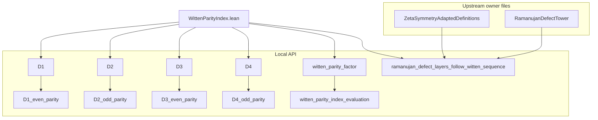

# WittenParityIndex API and Dependency Surface

Owner file:
- `lean/InfoGeometry/Arithmetic/WittenParityIndex.lean`

Status verified from live source:
- builds as an owner API file
- 0 `sorry`
- 0 `axiom`
- finite algebraic parity only

## Canonical scope

This module is the finite algebraic parity interface for the first four symbolic
Ramanujan-defect shapes. It does **not** prove or export:
- Riemann-hypothesis-level statements
- analytic continuation
- KMS / thermodynamic closure
- harmonic-kernel / Hodge-projector theorems
- topological protection claims

Those stronger interpretations must remain separate from this owner-file API
unless and until they are proved in the kernel under the exact repository names.

## Actual exported surface

Namespace:
- `InfoGeometry.Arithmetic.WittenParityIndex`

Definitions:
- `D1`
- `D2`
- `D3`
- `D4`
- `witten_parity_factor`

Closed theorems:
- `D1_even_parity`
- `D2_odd_parity`
- `D3_even_parity`
- `D4_odd_parity`
- `witten_parity_index_evaluation`
- `ramanujan_defect_layers_follow_witten_sequence`

Imported owner dependency:
- `InfoGeometry.Arithmetic.RamanujanDefectTower`

Opened namespaces for the final bridge theorem:
- `InfoGeometry.Arithmetic.RamanujanDefectTower`
- `InfoGeometry.Arithmetic.ZetaSymmetryAdaptedDefinitions`

## What the file actually proves

1. Finite polynomial parity identities:
   - degree-2 defect is even
   - degree-3 defect is odd
   - degree-4 defect is even
   - degree-5 defect is odd

2. Four-step Witten parity evaluation:
   - layer 1 -> `+1`
   - layer 2 -> `-1`
   - layer 3 -> `+1`
   - layer 4 -> `-1`

3. Compatibility with already verified Bernoulli-side Ramanujan readouts:
   - `ζ(3)`
   - `ζ(5)`
   - `ζ(7)`
   - `ζ(9)`

## What is NOT canonical in this module

The following are not part of the current owner-file API and should not be
presented as if this module proves them:
- `TrifactorOperator`
- `P_plus`, `P_minus`, `P_zero`
- `hodge_trifactor_partition`
- `harmonic_kernel_annihilated`
- any claim that the critical line is forced by this file
- any claim that this file closes topological / geometric RH architecture

If those concepts are wanted, they need either:
- an existing owner file elsewhere in the repo under exact names, or
- a new honest owner file with zero `sorry`, zero `axiom`, and verified imports

## Mermaid dependency graph

## Documentation-safe summary sentence

`WittenParityIndex.lean` is the finite algebraic parity interface linking the
four-step alternating Witten sign pattern `(+1,-1,+1,-1)` to the verified
Bernoulli-side Ramanujan defect readouts; it is not, by itself, a proof of any
analytic, thermodynamic, or Riemann-hypothesis-level statement.
